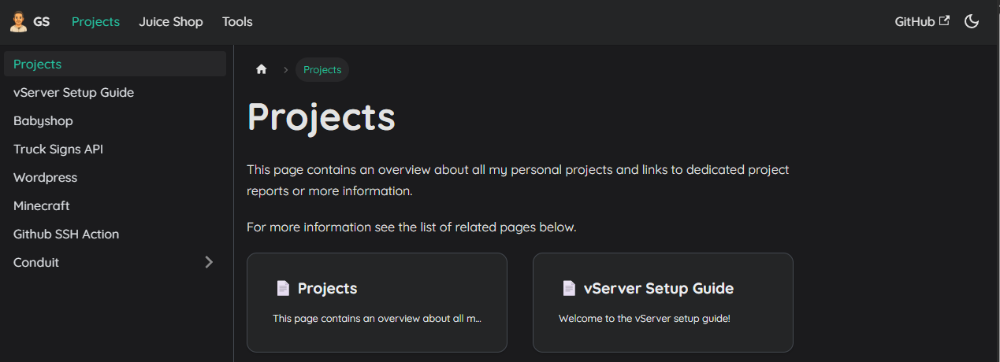

# 🧩 SysDocs – DevOps-Zone Documentation

[](https://github.com/GeorgStrassberger/SysDocs/actions)
[](https://ghcr.io/georgstrassberger/sysdocs)
[](https://github.com/GeorgStrassberger/SysDocs/releases)

📖 **System- & Projekt-Dokumentation für DevOps, Webentwicklung und IoT.**  
Bereitgestellt als Docusaurus-Webseite mit Docker-Deployment und automatischem CI/CD über GitHub Actions.

---

## 🚀 Features

- 🌐 **Mehrsprachig (i18n)** – Englisch & Deutsch via Docusaurus
- 🧱 **Containerized** – Docker-basierter Build mit Nginx für Production
- 🔁 **CI/CD Integration** – GitHub Actions + GHCR Deployment auf Hetzner
- ⚙️ **Traefik Reverse Proxy** – Automatisches HTTPS via Let’s Encrypt
- 🧩 **Modulare Docusaurus-Struktur** – Docs, Blog, Projekte & Tools
- 💡 **Automatische Versionierung** – Tag-basierte Releases (`v1.0.0`, `v1.1.0`, …)

---

## 🛠️ Tech Stack

| Technologie                             | Description                                |
|-----------------------------------------|--------------------------------------------|
| **[Docusaurus](https://docusaurus.io)** | Static Site Generator (React-basiert)      |
| **Docker / Nginx**                      | Containerisierung & statische Auslieferung |
| **Traefik**                             | Reverse Proxy + HTTPS                      |
| **GitHub Actions**                      | Automatisierte Builds & Deployments        |
| **GHCR (GitHub Container Registry)**    | Docker Image Hosting                       |
| **i18n**                                | Mehrsprachige Inhalte (EN/DE)              |

---

## Image from GHCR

```bash
docker pull ghcr.io/georgstrassberger/sysdocs:latest
```

---

## Preview

Docs

Page


---

## 🧰 Local Setup

### Prerequisites

- Node.js ≥ 18
- npm oder yarn
- Docker (optional für Build-Test)

### Start Devolpment

Clone this repository:

```bash
git clone https://github.com/GeorgStrassberger/sysdocs.git
cd ./sysdocs
```

Install dependencies and start development Server:

```bash
npm install
npm run dev
```

Build and start a production Server:

```bash
npm run build
npm run serve
```

---

## Author

```text

  ██████╗   ███████╗   ███████╗  █████████╗
 ██╔════╝   ██╔════╝  ██╔═════╝  ╚══██╔═══╝
 ██║  ███╗  █████╗    ╚█████╗       ██║
 ██║   ██║  ██╔══╝     ╚═══██╗      ██║
 ██║   ██║  ██║             ██╗     ██║
 ╚██████╔╝  ███████╗   ███████║     ██║
  ╚═════╝   ╚══════╝   ╚══════╝     ╚═╝

```