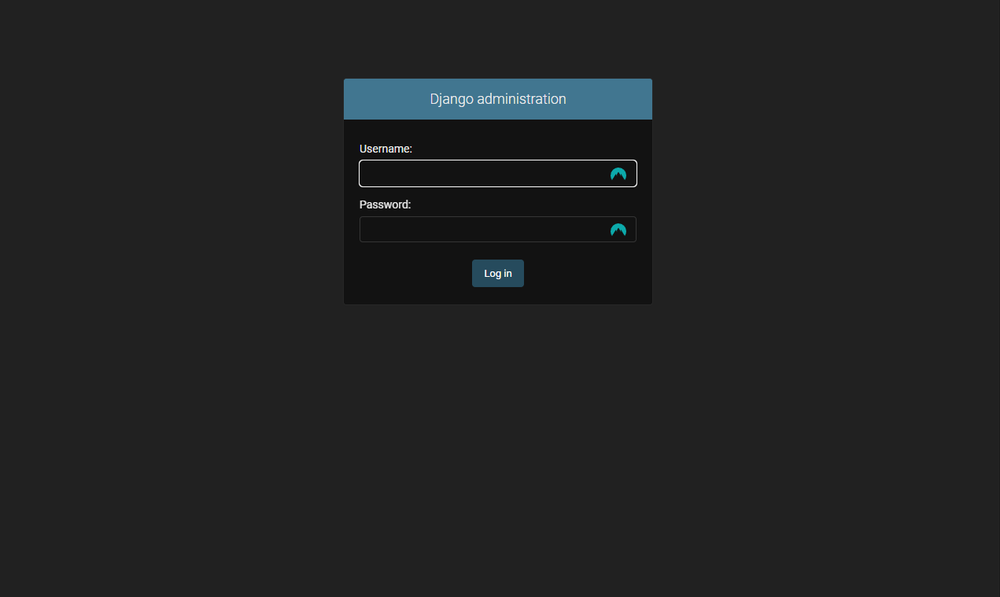
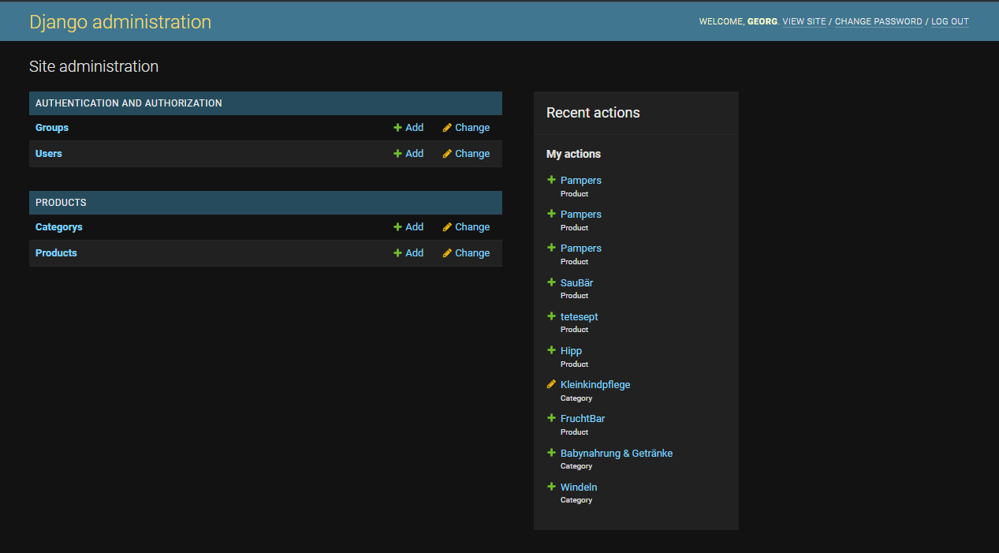
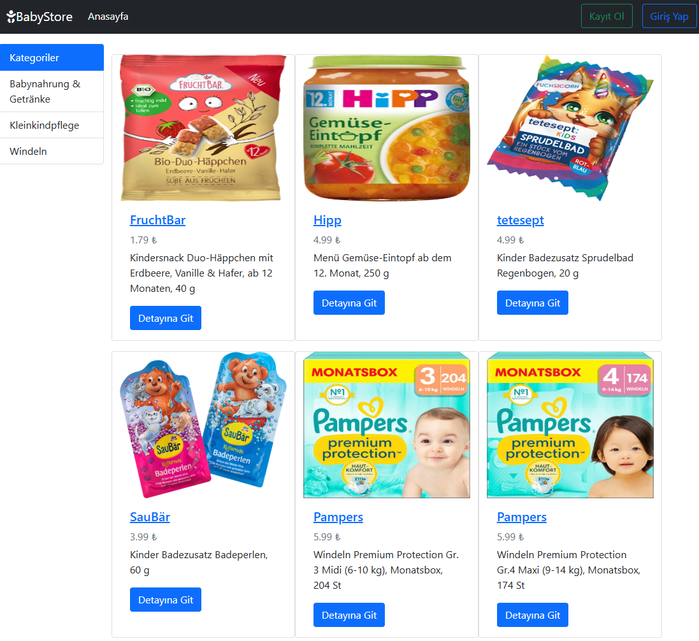

# Babyshop

---

## Table of Contents

- [Overview](#overview)
- [Prerequisites](#prerequisites)
- [Quickstart](#quickstart)
    - [1. Clone the Project](#1-clone-the-project)
    - [2. Build the Docker Image](#2-build-the-docker-image)
    - [3. Create Docker Volumes](#3-create-docker-volumes)
    - [4. Create a Docker Container from the Image](#4-create-a-docker-container-from-the-image)
    - [5. Log into the Container](#5-log-into-the-container)
    - [6. Create an Admin User](#6-create-an-admin-user)
    - [7. Open the Admin Dashboard](#7-open-the-admin-dashboard)
    - [8. Add Content to the Application](#8-add-content-to-the-application)
- [Preview](#preview)

---

## Overview

This repository serves as an example of how to use a Dockerfile to build a Docker image and subsequently create a container to host a Django-based project.

The project demonstrates:

- Building a custom Docker image for a Django application.
- Running the application in a Docker container.
- Hosting the application on a specified port accessible via the host system.

---

## Prerequisites

To run this project, ensure you have the following installed on your system:

- [Git](https://git-scm.com/) must be installed
- [Docker](https://www.docker.com/) must be installed

---

## Quickstart

### 1. Clone the Project

```bash
  git clone https://gitlab.com/geeser/baby_tool_shop.git
  cd baby_tool_shop/babyshop_app
```

### 2. Build the Docker Image

```bash
  docker build -t babyshop .
```

- `-t | tag` The -t option allows you to give the image an easily recognizable name and, optionally, a version (e.g., babyshop:1.0).
- `.`The dot (.) means the current directory is used as the build context.

> **Note**
> Link to the [Dockerfile](./babyshop_app/Dockerfile) with description.

### 3. Create Docker Volumes

To store the data persistently, so that it is not lost during a restart, we attach 2 volumes.
In this case for the database und images.

```bash
  docker volume create babyshop_db
  docker volume create babyshop_media
```

### 4. Create a Docker Container from the Image

```bash
  docker run -d \
    -p 8025:8000 \
    --name babyshop-app \
    -v babyshop_db:/babyshop/db \
    -v babyshop_media:/babyshop/media \
    --restart unless-stopped \
    babyshop
```

- `-d | detached` Runs the container in the background.
- `-p | port ` Maps the container's internal port (5000) to a port on the host system (8025).
- `--name ` Assigns a custom name to the container.
- `-v | Volume ` Mounts the data from the host system into the container.
- `--restart` Configures the container's restart policy.
    - `always` The container is always restarted, regardless of its exit status.
    - `unless-stopped` The container is restarted unless it was manually stopped.
    - `on-failure[:n]` The container is restarted only if it exits with a non-zero status (an error)
      Optionally, you can specify a limit on restart attempts (n).
    - `no` The container will not be restarted automatically (default behavior).

### 5. Log into the Container

```bash
  docker exec -it babyshop-app bash
```

- `exec` Allows you to run commands directly inside a container without restarting it.
- `-it | interactive & terminal` These options combined allow for an interactive shell session inside the container.
- `babyshop-app` The name of the container where the command will be executed.
- `bash` Starts the container's Bash shell, allowing you to work directly within the container.

### 6. Create an Admin User

```bash
  python manage.py createsuperuser
```

```bash
  Username: admin
  E-Mail-Adresse: admin@example.com
  Passwort: *****
  Passwort (nochmals): *****
```

### 7. Open the Admin Dashboard

Access the admin dashboard at: [http://localhost:8025/admin](http://localhost:8025/admin)



### 8. Add Content to the Application

Once logged in, add content to the application:

- Categorys
- Products
- Users
- Groups



---

## Preview

Below is a preview of the application running in the Docker container with content added:


