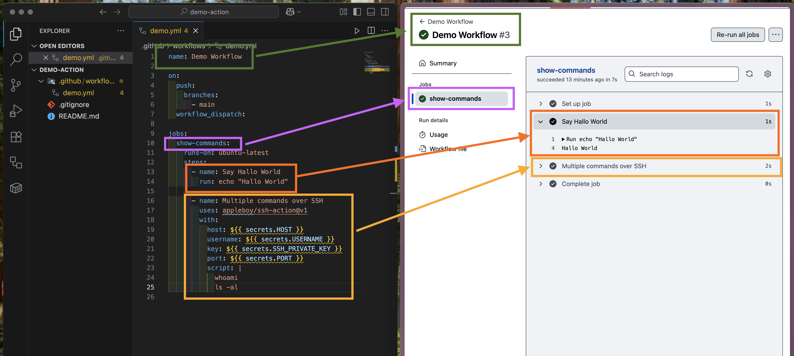

# Github SSH Action

to test the [appleboy/ssh-action](https://github.com/appleboy/ssh-action) connection.

---

Repo Link: https://github.com/GeorgStrassberger/demo-action

---

1) SSH-KEY erstellen
   

2) Github Repo anlegen

3) Github Security Variablen anlegen

4) Github Workflow erstellen

5) Github Actions aufrufen

