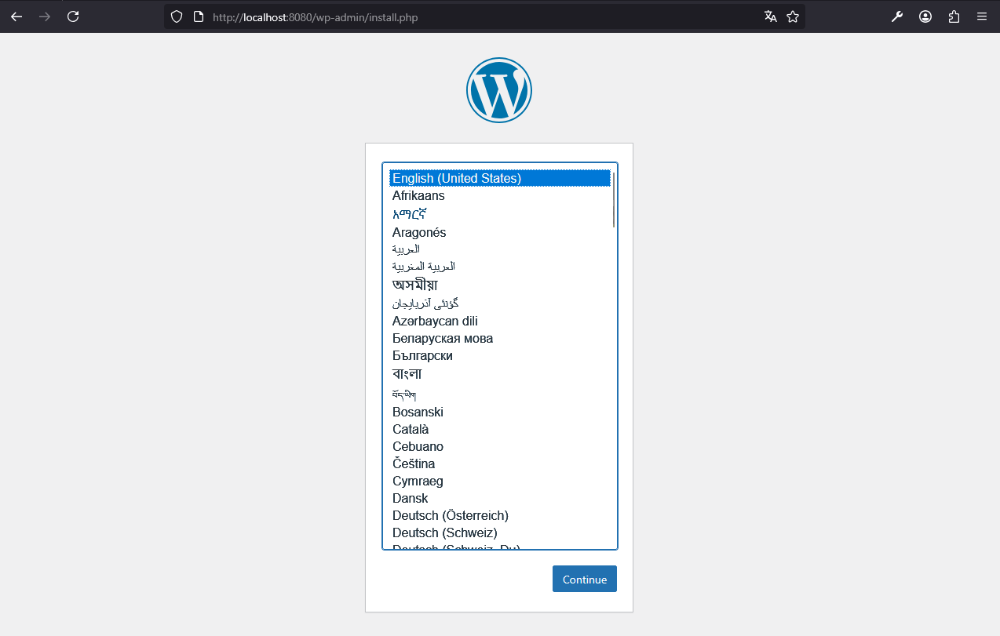
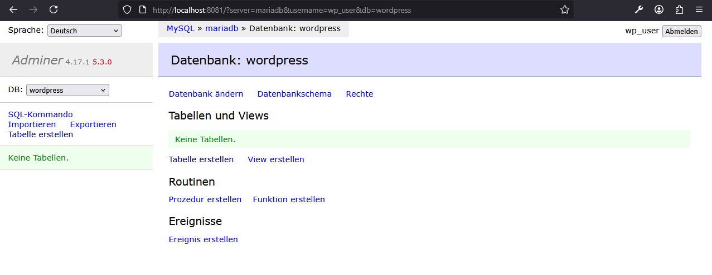

# Wordpress

An Example for a simple `docker compose` setup. To start a Wordpress application with a database and browser access.

---

## Table of Contents

- [Wordpress](#wordpress)
    - [Table of Contents](#table-of-contents)
    - [Description](#description)
    - [Prerequisites](#prerequisites)
    - [Repository Structure](#repository-structure)
    - [Quickstart](#quickstart)
    - [Usage](#usage)
    - [Author](#author)

---

## Description

A simple demo showing how `docker compose` works with multiple services.

Services included:

```bash
- WordPress    #Application
- Mariadb      #Database
- Adminer      #Database GUI
```

---

## Prerequisites

- [Docker](https://www.docker.com/) must be installed on your system with `compose` plugin
- [Git](https://git-scm.com/) must be installed on your system

---

## Repository Structure

```bash
wordpress_example/
├── docker-compose.yml                  # Docker container setup
├── img/                                # All Images (Screenshots)
├── .env.example                        # All environment variables
├── .gitignore                          # Ignore rules for Git
├── README.md                           # Project overview and navigation
└── Wordpress_Checkliste.pdf            # Checklist_DA
```

---

## Quickstart

1. Download the project:

```bash
git clone https://github.com/GeorgStrassberger/wordpress_example.git
```

2. Navigate into the project folder

```bash
cd ./wordpress_example
```

3. Create your .env file
```bash
cp .env.example .env
```

4. Change the environment variables
```text
# Copy this file to .env and fill in the values
# WordPress Example Environment Variables
WORDPRESS_DB_HOST=mariadb:3306      
WORDPRESS_DB_NAME=wordpress        
WORDPRESS_DB_USER=wp_user           #Your Username
WORDPRESS_DB_PASSWORD=wp_pass       #Your Password

# MariaDB Environment Variables    
MYSQL_DATABASE=wordpress            
MYSQL_USER=wp_user                  #Your Username
MYSQL_PASSWORD=wp_pass              #Your Password
MYSQL_ROOT_PASSWORD=root_pass       #Your Root Password
```

5. Pull Docker images and start the containers

```bash
docker compose up -d
```

- `docker compose`: container group
- `up`: Start all container
- `-d`: detached mode (runs in the background)

6. Open your browser to access WordPress on [http://localhost:8080](http://localhost:8080)
   

7. Open your browser to access Adminer on [http://localhost:8081](http://localhost:8081)

   

8. Adminer Login
   

9. Stop and remove the containers and volumes

```bash
docker compose down -v
```

- `docker compose`: container group
- `down`: stop and remove all containers
- `-v`: also remove volumes (data)

---

## Usage

After starting the containers, you can:

1. Access WordPress
- URL: http://localhost:8080
- Complete the initial WordPress setup wizard (choose site name, admin user, password)

2. Access Adminer (Database GUI)
- URL: http://localhost:8081

**Normal User Login:**
```bash
User-Login (user access):
System:         MySQL       #DB type
Server:         mariadb     #Docker service name of the database container
Username:       wp_user     #MYSQL_USER
Password:       wp_pass     #MYSQL_PASSWORD
Datenbank:      wordpress   #MYSQL_DATABASE
```

**Root Login:**
```bash
Root-Login (administrator access):
System:         MySQL       #DB type
Server:         mariadb     #Docker service name of the database container
Username:       root        #MYSQL_USER
Password:       root_pass   #MYSQL_ROOT_PASSWORD
Datenbank:      (empty)
```

---

## Author

```text

  ██████╗   ███████╗   ███████╗  █████████╗
 ██╔════╝   ██╔════╝  ██╔═════╝  ╚══██╔═══╝
 ██║  ███╗  █████╗    ╚█████╗       ██║
 ██║   ██║  ██╔══╝     ╚═══██╗      ██║
 ██║   ██║  ██║             ██╗     ██║
 ╚██████╔╝  ███████╗   ███████║     ██║
  ╚═════╝   ╚══════╝   ╚══════╝     ╚═╝
```

---