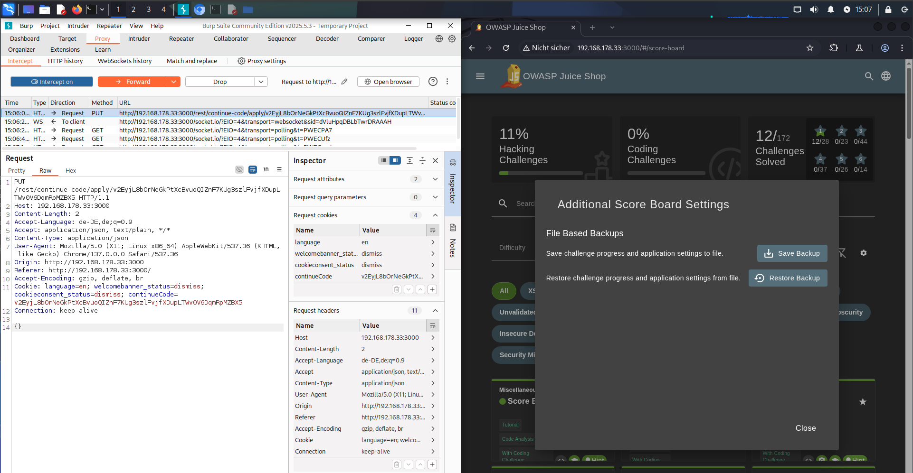
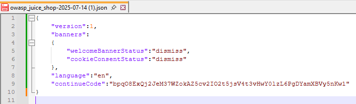
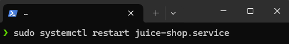
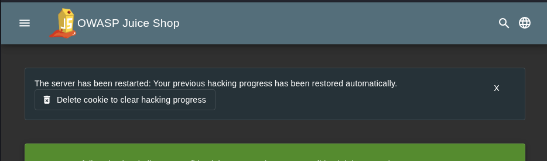
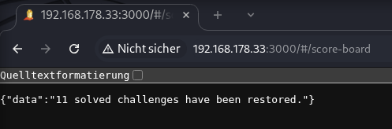

# Bonus Challenge DA

***1 Star Challenge X/28***

Stelle deinen Score-Board Zustand des OWASP Juice Shops wieder her ohne das Laden der `*.json` Datei.

---

## 1. Restore Challenges with JSON

1. open Additional Score Board Settings
2. Intercaept on
3. Restore Backup
4. chuce file
5. select "Apply changes now"
6. open PUT Request, to see header information
7. 
8. Save Method and URL 
9. open your saved_challenges.json file 
10. copie your `contunueCode`
11. create a file and build the new URL & Method  `PUT /rest/continue-code/apply/bpqO8ExQj2JeM37WZokAZ5cv2IO2t5jsV4t3vHwY0lzL6PgDYamXBVy5nKw1`

---

## 2. Restore Challanges without JSON

1. Restart service 
2. 
2. Delete cookie to clear hacking progress
3. 
4. restart service again
3. reload page /
6. Burpsuite "Intercept on"
7. Refresh page
8. Change Request to PUT /rest/continue-code/apply-.....
9. Burpsuite "Forward"
10. 
10. Burpsuite "Intercept off"
11. reload page
12. go back to /#/score-board

:::success
Successfully all challenges loaded.
:::