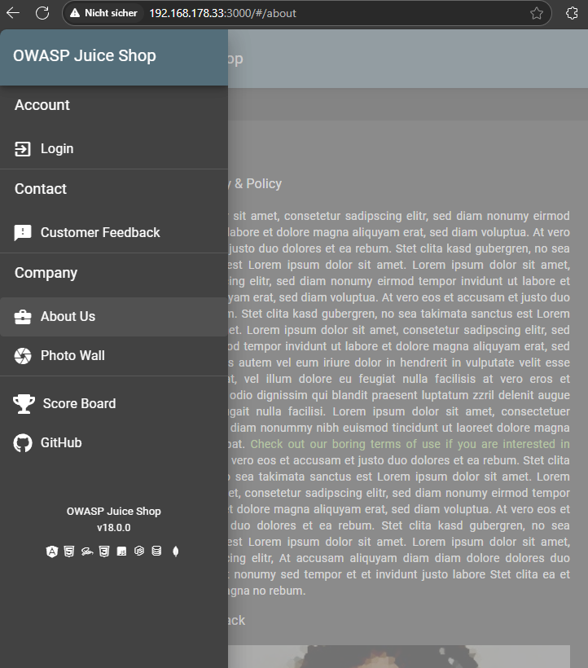
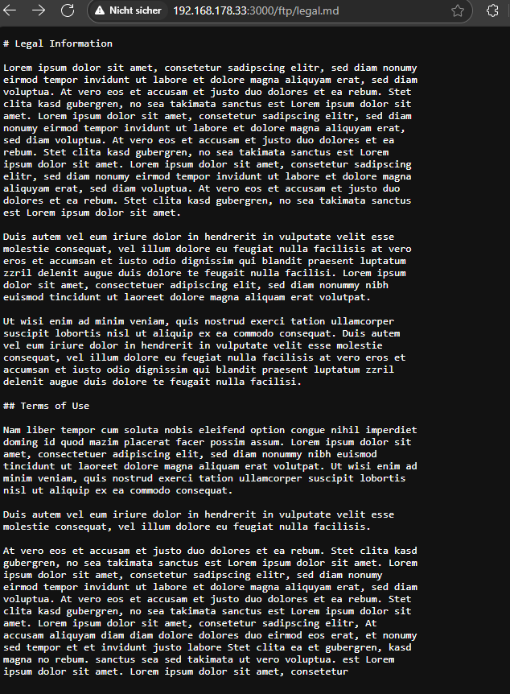
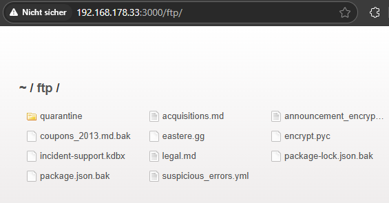
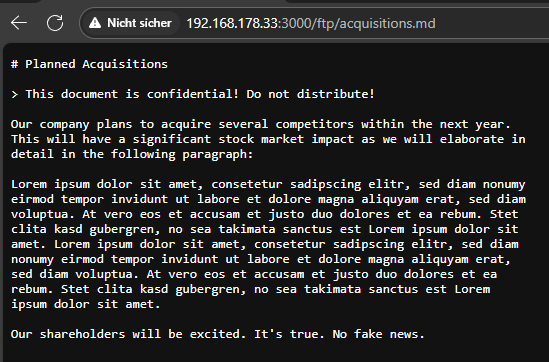

# Confidential Document

***1 Star Challenge 3/28***

Access a confidential document.

---

## DE
Unter der Seciton `About Us` befindet sich im Lorem Ipsum text ein [Link](http://localhost:3000/ftp/legal.md). 



Wenn man diesen öffnet, bekommt man eine Markdown Datei angezeigt, namens `legal.md` oder wird heruntergeladen.
Dadurch sehen wir das sich die URL im Browser geändert hat zu `/ftp/legal.md`.



Wordurck wir rückschlüsse ziehen können das die seite noch einen ftp server hat um Datein bereit zustellen.
Wir entfernen das legal.md aus der URL und schauen was passiert.



Die oberfläche es ftp server wird angezeigt und hier können wir und sämtliche dokumente ansehen die der FTP-Server bereitstellt.
Wenn wir und die richtige Datei geöffnet haben, finden wir das geheime Dokument. 



:::success Challenge completed!
You successfully solved a challenge: Confidential Document (Access a confidential document.)
:::

---

## EN

Go to /about section and start the 'burpsuite' with 'intercapt on', click on the link for the Terms.
You will get a Markdown file.
Now look into your `burpsuite proxy` and open the GET Request. You can see the path to *http://localhost:3000/ftp/legal.md*. 
We can see an *FTP* server exists. 
Try to open there with `http://localhost:3000/ftp`. 

The file what we searching for is `acquisitions.md`.

````url
http://localhost:3000/ftp/acquisitions.md
````

:::success Challenge completed!
You successfully solved a challenge: Confidential Document (Access a confidential document.)
:::