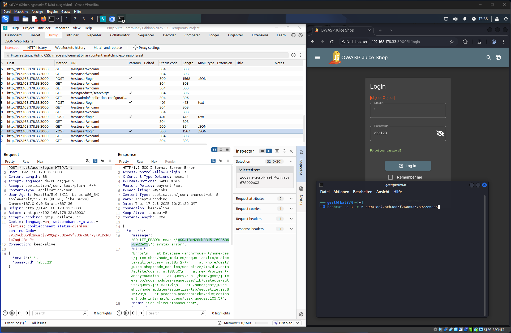
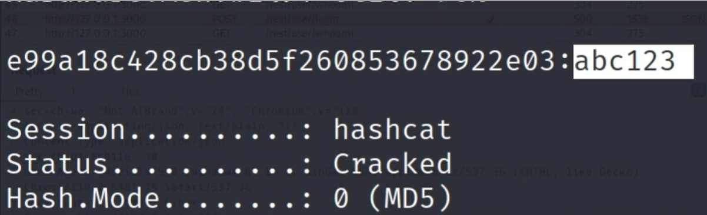
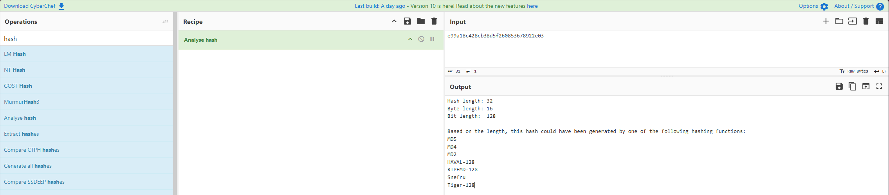

# Juice Shop Hash Algorithmus

Which `HASH` algorithm does the **OWASP Juice Shop** use?

---

Open `Burpsuite` catch the response error message, copy the token.
Use Hashcat in your terminal. If it matched, you can see the Hash.Mode (MD5) 



````bash
hashcat -a 3 -m 0 e99a18c428cb38d5f260853678922e03
````



---

You can also use webpages like [CyberChef](https://gchq.github.io/CyberChef/)




