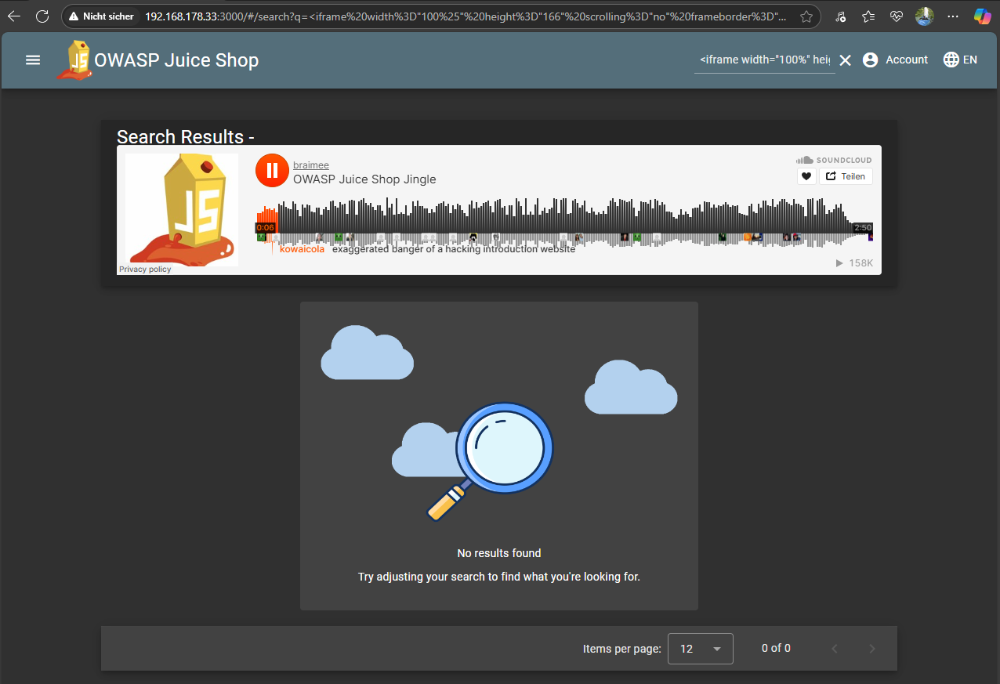

# Bonus Payload

***1 Star Challenge 7/28***

Use the bonus payload `<iframe width="100%" height="166" scrolling="no" frameborder="no" allow="autoplay" src="https://w.soundcloud.com/player/?url=https%3A//api.soundcloud.com/tracks/771984076&color=%23ff5500&auto_play=true&hide_related=false&show_comments=true&show_user=true&show_reposts=false&show_teaser=true"></iframe>` in the DOM XSS challenge.

---

The same procedure as in DOM XSS.
Try to find a place to enter the **javascript code** from your challenge card.
You can use every input field like a *SEARCHBAR*.

Like in this example picture.

Go back to the start page once and the success message appears.

:::success Challenge completed!
You successfully solved a challenge: Bonus Payload (Use the bonus payload <iframe width="100%" height="166" scrolling="no" frameborder="no" allow="autoplay" src="https://w.soundcloud.com/player/?url=https%3A//api.soundcloud.com/tracks/771984076&color=%23ff5500&auto_play=true&hide_related=false&show_comments=true&show_user=true&show_reposts=false&show_teaser=true"></iframe> in the DOM XSS challenge.)
:::