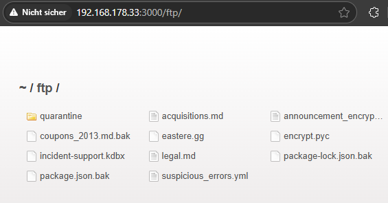

# Confidential Document

***1 Star Challenge 3/28***

Access a confidential document.

---

Under the section `About Us` there is a [Link](http://localhost:3000/ftp/legal.md) in the Lorem Ipsum text.

If you open this, you will see a Markdown file called `legal.md` or it will be downloaded.
This shows us that the URL in the browser has changed to `/ftp/legal.md`.

Which allows us to conclude that the site still has an ftp server to provide files.
We remove the legal.md from the URL and see what happens.

The ftp server interface is displayed and here we can view all the documents that the FTP server provides.
If we have opened the right file, we will find the secret document.

:::success Challenge completed!
You successfully solved a challenge: Confidential Document (Access a confidential document.)
:::
