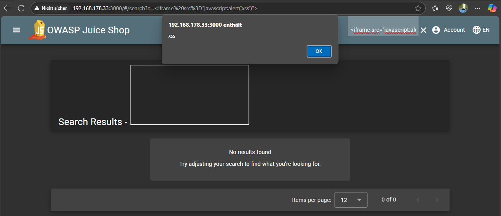

# DOM XSS

***1 Star Challenge 5/28***

Perform a DOM XSS attack with `<iframe src="javascript:alert('xss')">`.

---

Try to find a place to enter the **javascript code** from your challenge card.
You can use every input field like a *SEARCHBAR*.

Like in this example picture.

Go back to the start page once and the success message appears.

:::success Challenge completed!
You successfully solved a challenge: DOM XSS (Perform a DOM XSS attack with `<iframe src="javascript:alert('xss')">`).
:::
