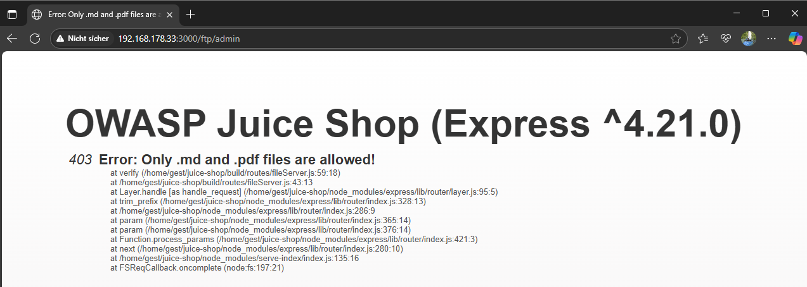

# Error Handling

***1 Star Challenge 13/28***

Provoke an error that is neither very gracefully nor consistently handled.

---

To trigger an error that is not intercepted by the backend and outputs it unhandled. It is sufficient to specify a wrong url path that does not exist. Or to send a wrong/incorrect data packet.

For example, when trying to reach an endpoint like `http://localhost:3000/ftp/admin`, the server gives you tle direct error message like in the picture.

Go back to the start page once and the success message appears.

:::success Challenge completed!
You successfully solved a challenge: Error Handling (Provoke an error that is neither very gracefully nor consistently handled.)
:::