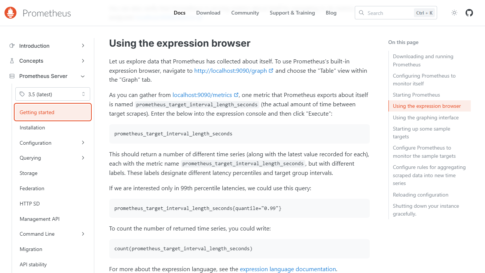
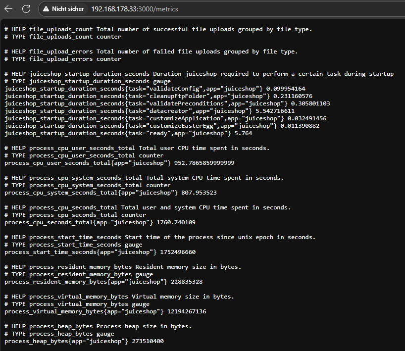

# Exposed Metrics

***1 Star Challenge 9/28***
 
Find the endpoint that serves usage data to be scraped by a popular monitoring system.

----

:::
Die Wordlist der DA wird erwähnt.
:::

In der Aufgabe befindet sich ein [Link](https://github.com/prometheus/prometheus) zum Github repo von einem tool namens `Prometeus`.
In der Dokumentation von Prometeus können wir herausfinden wie man das ganze installiert und verwendet.

Darin finden wir 2 URL endpunkte die wir ausprobieren können. `http://localhost:3000/metrics`, `http://localhost:3000/graph`

:::success Challenge completed!
You successfully solved a challenge: Exposed Metrics (Find the endpoint that serves usage data to be scraped by a popular monitoring system.)
:::