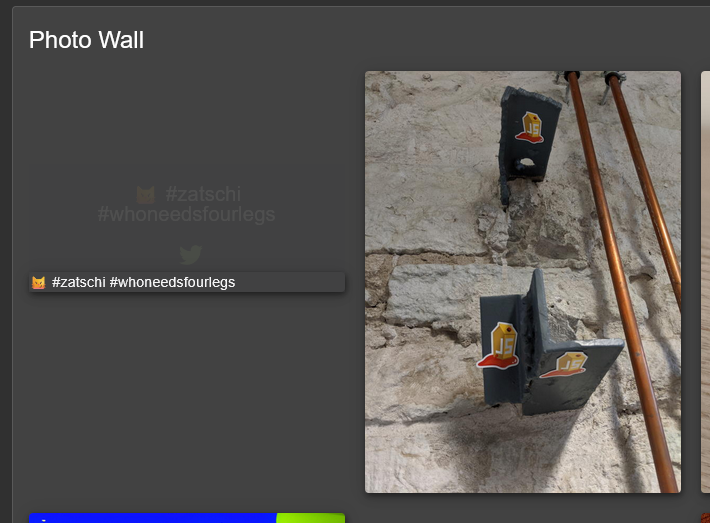
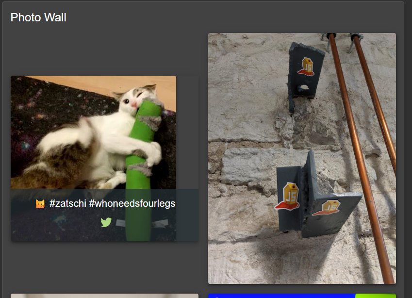

# Missing Encoding

***1 Star Challenge 5/28***

Retrieve the photo of Bjoern's cat in "melee combat-mode".

----

Find the missing Image.
Inspect the webpage, find the URL-path and take a close look on it.



````path
src="assets/public/images/uploads/ᓚᘏᗢ-#zatschi-#whoneedsfourlegs-1572600969477.jpg"
````

Hashtags in HTML refer to an ID and shot not be in an path. To aviod this you need to encode spacial characters. 
Like `# < > | " '` and more.

Now change the `#` to urlencoded chars `%23`.

````path
src="assets/public/images/uploads/ᓚᘏᗢ-%23zatschi-%23whoneedsfourlegs-1572600969477.jpg"
````



:::success Challenge completed!
You successfully solved a challenge: Missing Encoding (Retrieve the photo of Bjoern_s cat in "melee combat-mode").
:::


**Helpfull Pages:**
- https://gchq.github.io/CyberChef/


