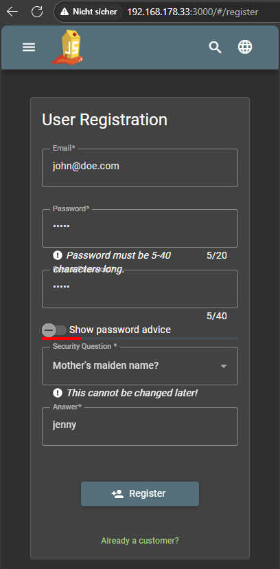
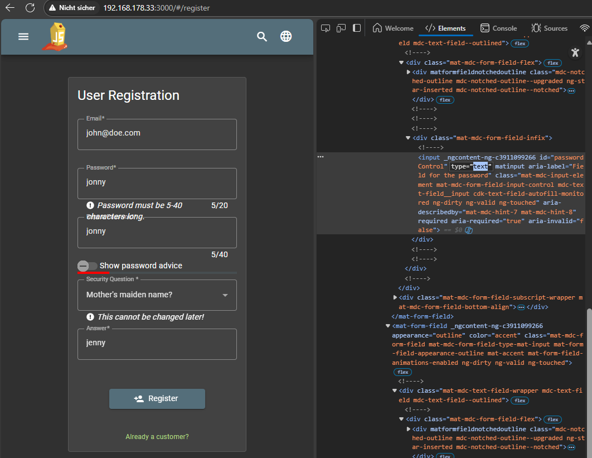
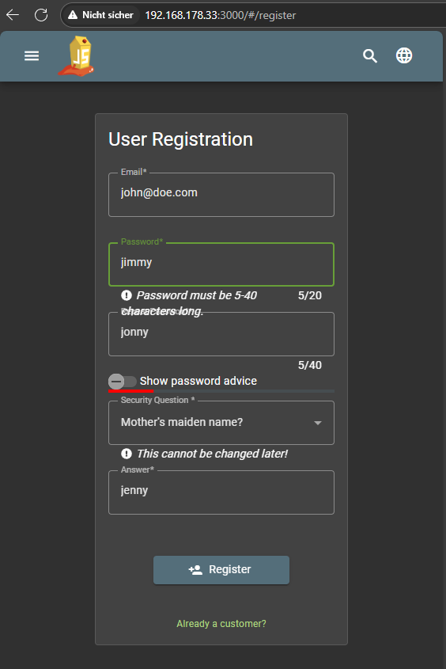

# Repetitive Registration

***1 Star Challenge 10/28***

Follow the DRY principle while registering a user.

----

> DRY:
> ***D***on't
> ***R***epeat
> ***Y***ourself
>
> "Wiederhole dich nicht"


Der normale Vergang der Registierung funktioniert einwandfrei.



Im Browser kann man die Passwort anzeige einfach ändern. In dem man auf der Seite mit der *Rechten Maustaste* das *Context Menü* öffnet, und auf Untersuchten klickt.
Das Passwort eingabefeld sucht und die Anzeige attribute untersucht und z.B. `text="password"` ändert oder entfernt. 



Wenn die 2te Passwort eingabe übereinstimmmt. Wird das erste nicht mehr neu geprüft.
Erst wieder wenn man im 2ten etwas ändert. Dadurch kann man beabsichtigt ein falschen Passwort angeben wenn es der Server nicht nochmal gegenprüft.



Falsche Eingabe (OHNE das Passwort nochmal zu wiederholen) bestätigen und fertig.

:::success Challenge completed!
You successfully solved a challenge: Repetitive Registration (Follow the DRY principle while registering a user.)
:::

---

## Login

Beim Login wird nur das erste Passwort benötigt

```
email: john@doe.com
password: jimmy
```