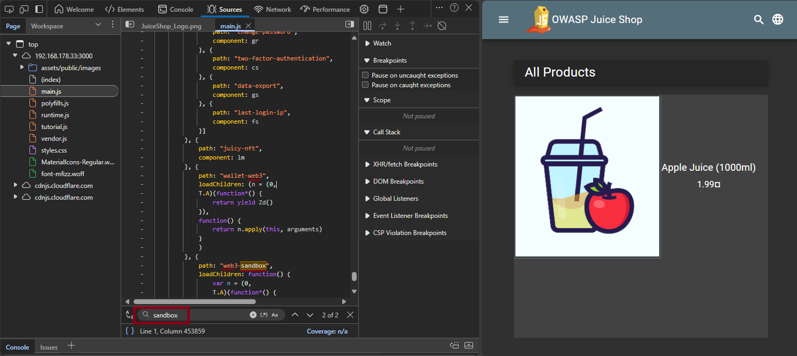
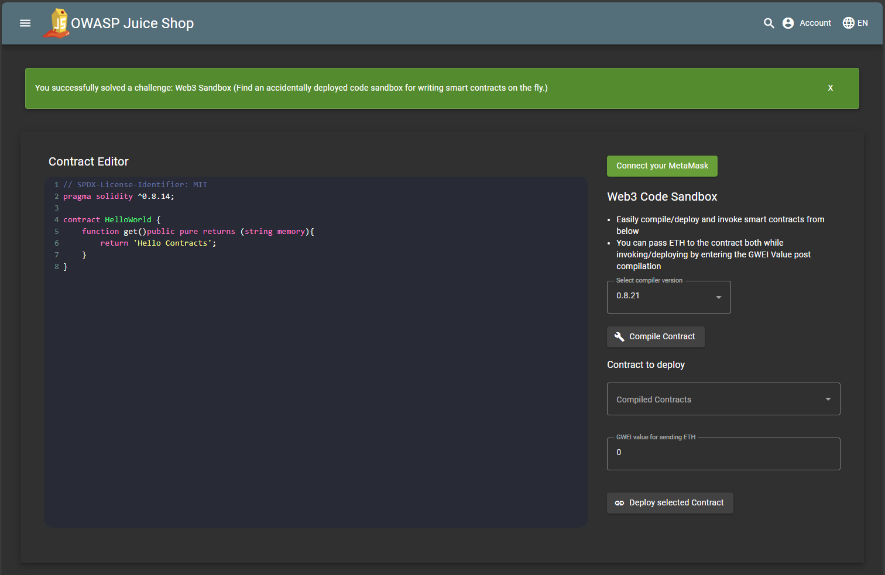

# Web3 Sandbox

**Broken Access Control**

> *Find an accidentally deployed code sandbox for writing smart contracts on the fly.*

---

## Difficulty

⭐☆☆☆☆☆ 1-Star Challenge (Easy)

---

## Description

An accidentally exposed endpoint (`/web3-sandbox`) grants access to a smart contract code sandbox. The endpoint requires no authentication or authorization, making this a textbook example of **Broken Access Control**.

> **Broken Access Control** occurs when users are able to access functions or data they are not authorized to interact with. This typically results from missing or misconfigured access control mechanisms.

---

## Hint

Find an accidentally deployed code sandbox.
- It is just as easy as finding the Score Board.

---

## Approach

1. The lab environment was started, and the Juice Shop application was accessed via browser:  
   [http://127.0.0.1:3000](http://127.0.0.1:3000)

2. Using the browser DevTools (F12), the source code (`index.html`, `main.js`, etc.) was examined for potential hidden routes, including keywords such as:
    - `/sandbox`
    - `/web`
    - `/editor`
    - `/contracts`
    - `/access`
    - ...

   

3. Accessing the URL: `http://127.0.0.1:3000/#` + `/web3-sandbox` opened a publicly accessible code sandbox interface.

4. The challenge automatically marked as **solved** upon visiting the page.

---

## Evidence (Screenshot)

```text
URL: http://127.0.0.1:3000/#/web3-sandbox
Status Code: 200 OK
Access: No authentication or special permissions required
```


