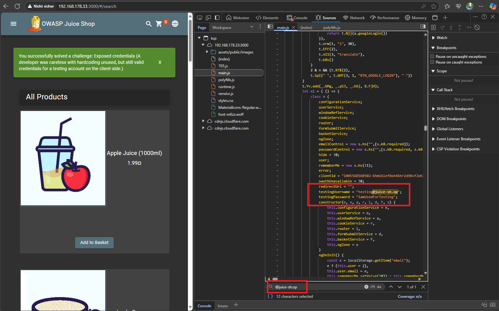

# Exposed credentials

**Sensitive Data Exposure**

> *A developer was careless with hardcoding unused, but still valid credentials for a testing account on the client-side.*

---

## Difficulty

⭐⭐☆☆☆☆ 2-Sterne-Challenge (easy)

---

## Description

This challenge demonstrates a common security risk where sensitive credentials are accidentally left in client-side code. Although the account is not linked to any menu item or role, it is still active and can be used to log in.

---

## Hint

A developer was careless with hardcoding unused but still valid credentials

---

## Approach

1. Opened the application at:  
   [http://127.0.0.1:3000](http://127.0.0.1:3000)

2. Opened browser **DevTools(`F12`) -> `Sources`** the `main.*.js` file.

3. Used the search function (`Ctrl+F`) to search for keywords such as:
    - `email`, `password`
    - `credentials`
    - `test@`, `user@` or `admin@`
    - `@juice-sh.op`

4. You will find hardcoded login credential:
   ```js
    {   
        testingUsername = "testing@juice-sh.op",
        testingPassword = "IamUsedForTesting"
    }

5. Login with the testing credentials and the challenge automatically marked as **solved**.
---

## Evidence (Screenshot)



:::
You successfully solved a challenge: Exposed credentials (A developer was careless with hardcoding unused, but still valid credentials for a testing account on the client-side.)
:::