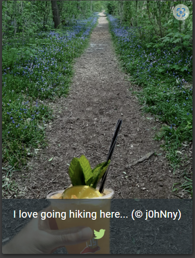
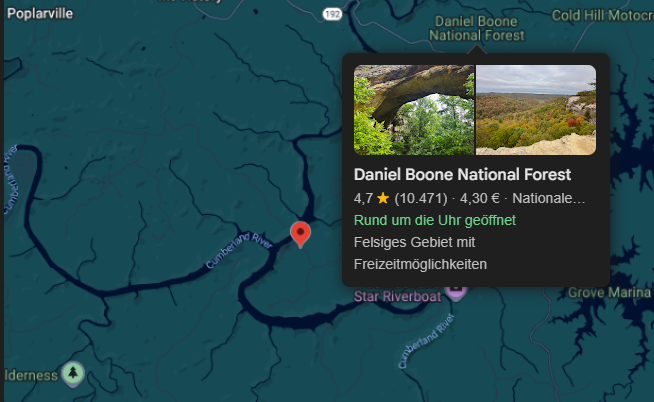

# Meta Geo Stalking

***2 Star Challenge 1/23***

Determine the answer to John's security question by looking at an upload of him to the Photo Wall and use it to reset his password via the [Forgot Password](http://localhost/#/forgot-password) mechanism.

---

tools:
- exiftool 
- 

---

Security Question:
- Your eldest siblings middle name?
- Mother's maiden name?
- Mother's birh date? (MM/DD/YY)
- Father's birh date? (MM/DD/YY)
- Maternal grandmotherÄs first name?
- Paternal grandmother's first name?
- Name of your favorite pet?
- Last name of dentist when you were a teenager? (Do not include 'Dr,')
- Your ZIP/postal code when you were a teenager?
- Company you first work for as an adult?
- Your favorite book?
- Your favorite movie?
- Number of one of your customer or ID cards?
- What's your favorite place to go hiking?

---

Bei der **Photo-Wall** finden wir eine Menge bilder mit Kommentarten. Wie z.B. das Bild von j0hNny, wo er am liebsten hiking geht.



Wir speichern und das Bild einfach auf unsere kalivm, im Projektordner.

Jetzt öffenen wir das bild mit den `exiftool pfad/zu/jonnys.bild`.

Jetzt sehen wir alle Meta informationen zu diesem Bild.

````bash
┌──(kali㉿kaliVM)-[~/Schreibtisch/JuiceShop]
└─$ exiftool favorite-hiking-place.png 
ExifTool Version Number         : 13.25
File Name                       : favorite-hiking-place.png
Directory                       : .
File Size                       : 667 kB
File Modification Date/Time     : 2025:07:19 11:39:57+02:00
File Access Date/Time           : 2025:07:19 11:40:13+02:00
File Inode Change Date/Time     : 2025:07:19 11:40:10+02:00
File Permissions                : -rw-rw-r--
File Type                       : PNG
File Type Extension             : png
MIME Type                       : image/png
Image Width                     : 471
Image Height                    : 627
Bit Depth                       : 8
Color Type                      : RGB
Compression                     : Deflate/Inflate
Filter                          : Adaptive
Interlace                       : Noninterlaced
Exif Byte Order                 : Little-endian (Intel, II)
Resolution Unit                 : inches
Y Cb Cr Positioning             : Centered
GPS Version ID                  : 2.2.0.0
GPS Latitude Ref                : North
GPS Longitude Ref               : West
GPS Map Datum                   : WGS-84
Thumbnail Offset                : 224
Thumbnail Length                : 4531
SRGB Rendering                  : Perceptual
Gamma                           : 2.2
Pixels Per Unit X               : 3779
Pixels Per Unit Y               : 3779
Pixel Units                     : meters
Image Size                      : 471x627
Megapixels                      : 0.295
Thumbnail Image                 : (Binary data 4531 bytes, use -b option to extract)
GPS Latitude                    : 36 deg 57' 31.38" N
GPS Longitude                   : 84 deg 20' 53.58" W
GPS Position                    : 36 deg 57' 31.38" N, 84 deg 20' 53.58" W          
````

Wo ist den jetzt der lieblingsplatz von Jonny zum hiking? Sehen wir nach wo das bild aufgenommen wurde, anhand der GPS Coordinaten.

`36 deg 57' 31.38" N, 84 deg 20' 53.58" W` eingabe anpassen `36°57'31.4"N 84°20'53.6"W` 



Wenn du einen treffer hast. Versuchen wir das Password von jonny zurückzusetzen unter [Forgot your Password](http://localhost:3000).

Wir habe schon ein paar email adressen gesehen bei den Produkt karten und im Admin Account wie die in der regel aussehen. `*@juice-sh.op`

Wir versuchen `john@juice-sh.op` und wenn wir nun in das **Security Question** feld klicken bekommen wir auch seine frage angezeigt. 

"What's your favorite place to go hiking?"

Wir geben `london` ein und vergeben ein neues Passwort z.B. **london**

FALSCHE Antwort auf die Frage. 

Wir versuchen es weiter mit begriffen auf der karte. wie z.B. `Daniel Boone National Forest`


:::success Challenge completed!
You successfully solved a challenge: Meta Geo Stalking (Determine the answer to John's security question by looking at an upload of him to the Photo Wall and use it to reset his password via the Forgot Password mechanism.)
:::
