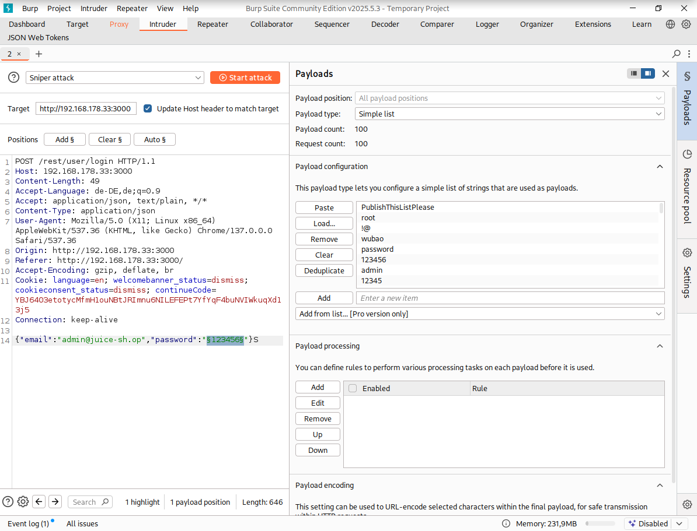
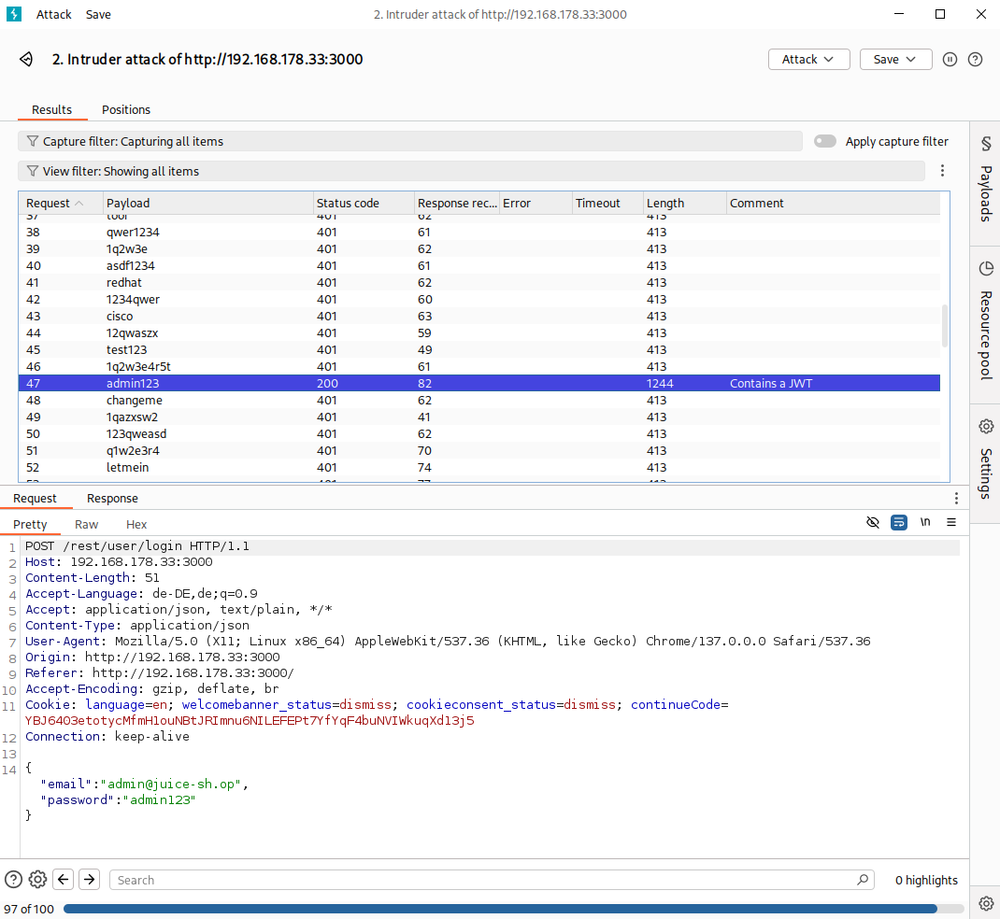

# Password Strength

***2 Star Challenge 5/23***

Log in with the administrator's user credentials without previously changing them or applying SQL Injection.

---

## Tools
- Burpsuite
- Email-address from the Admin Account. (admin@juice-sh.op)
- [password-list.txt](https://github.com/WillieStevenson/top-100-passwords/blob/master/password-list.txt)

---

Auf der Login seite die Admin email eingeben und ein beliebiges passwort

In der burpsuite mit dem "Proxy" auf "Intercept on" und den request abfangen.

Den Inhalt des requests in den "Intruder" kopieren. Oder mit STRG+I im tool weiterleiten.

Markieren des Passworts und auf Add klicken, dadurch wird vor und hinterdem password ein § Symbol eingestzt.

Dann im Fenster "Payload" den inhalt der "password-list.txt" reinkopieren.

Datei öffnen alles markieren, kopieren und in dem "Payload" fenster auf "Paste" klicken.

"Sniper atteck" auswählen und "Start attack" klicken.

Der Eintrag mit dem Statuscode 200 war erfolgreich und zeigt uns das richtige passwort ***admin123*** an. 

Login kontrollieren. 

:::success Challenge completed!
You successfully solved a challenge: Password Strength (Log in with the administrator's user credentials without previously changing them or applying SQL Injection.)
:::