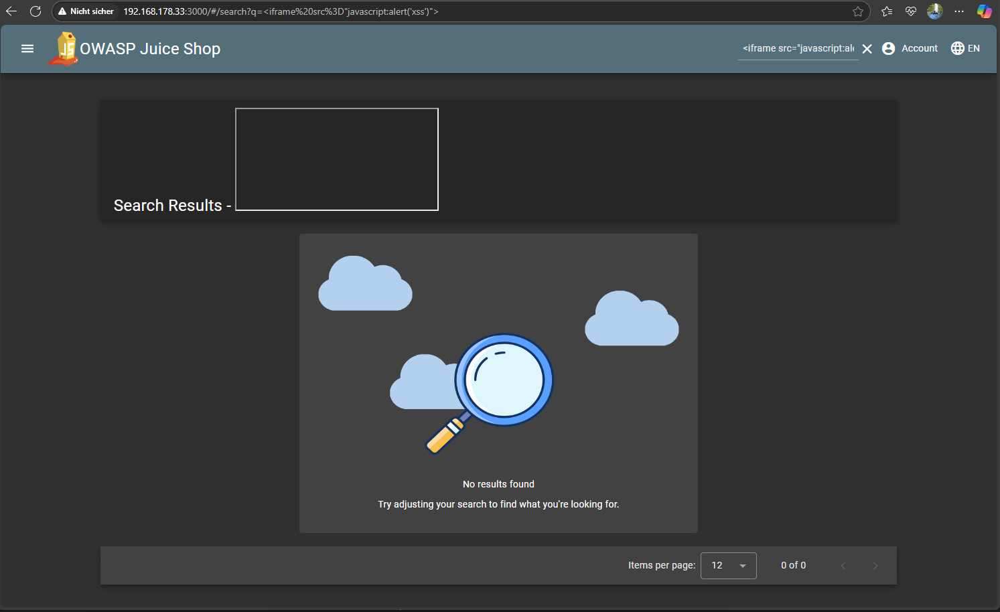
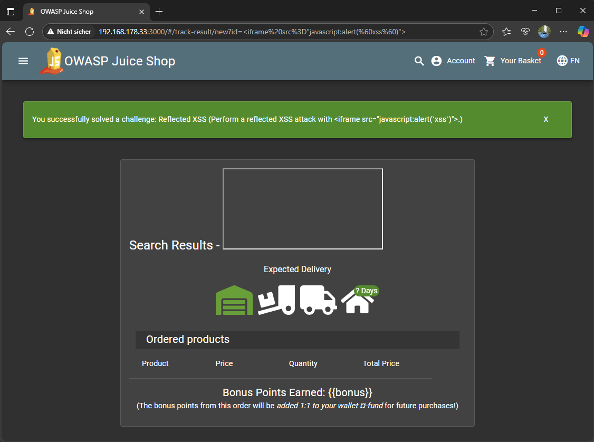

# Reflected XSS

**XSS**

> *Perform a reflected XSS attack with < iframe src="javascript:alert(`xss`)" >.*

---

## Difficulty

⭐⭐☆☆☆☆ 2-Sterne-Challenge (easy)

---

## Description

This challenge demonstrates a reflected cross-site scripting vulnerability. The goal is to inject a JavaScript payload via URL parameters and have it executed by the browser. The payload to use is:

```html
<iframe src="javascript:alert(`xss`)">
```


**Result:** No script executed. The payload was either sanitized or not reflected at all. Search for other places that may have been forgotten.

---

## Hint
Perform a reflected XSS attack

>Reflected Cross-site Scripting (XSS) occur when an attacker injects browser executable code within a single HTTP response. The injected attack is not stored within the application itself; it is non-persistent and only impacts users who open a maliciously crafted link or third-party web page. The attack string is >included as part of the crafted URI or HTTP parameters, improperly processed by the application, and >returned to the victim.

- Look for a URL parameter where its value appears on the page it is leading to
- Try probing for XSS vulnerabilities by submitting text wrapped in an HTML tag which is easy to spot on screen, e.g. `<h1>` or `<strike>`.

---

## Approach

1. Started the Juice Shop lab environment and accessed the application at:
   [http://127.0.0.1:3000](http://127.0.0.1:3000)

2. Investigated areas with user input or URL-based parameters:
    - Top-right search bar
    - Feedback form
    - Contact form
    - URL query parameters (e.g., /search?q=...)

3. Explored the application using an authenticated account to reach all available routes. This included completing a full checkout flow:
   ```text
   /#/login                                   // Login
   /#/search                                  // Add Product
   /#/basket                                  // Basket
   /#/address/select                          // Select address
   /#/address/create                          // Add address
   /#/address/select                          // Select address
   /#/delivery-method                         // Choose delivery
   /#/payment/shop                            // Choose payment
   /#/order-summary                           // Order summary
   /#/order-completion/2a35-78a41ac8367407e9  // Order confirmation
   /#/order-history                           // Order history
   /#/track-result?id=2a35-78a41ac8367407e9   // Order tracking
   ```

4. Enter payload in the URL instead of the order ID
   ```
   http://127.0.0.1:3000/#/track-result?id=<iframe src="javascript:alert(`xss`)">
   ```

5. The XSS payload triggered successfully and the challenge was automatically marked as solved upon script execution.

---

## Evidence (Screenshot)

```text
URL: http://127.0.0.1:3000/#/search?q=<iframe src="javascript:alert(`xss`)">
Payload executed: ✅
Browser alert: "xss"
```



:::
You successfully solved a challenge: Reflected XSS (Perform a reflected XSS attack with
< iframe src="javascript:alert(`xss`)">.)
:::
