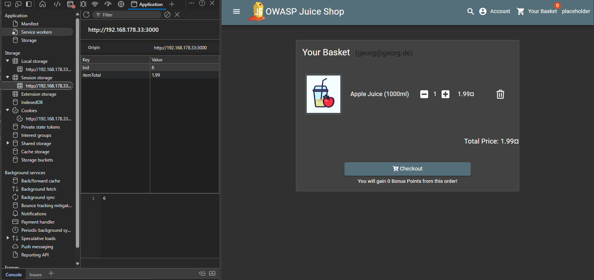
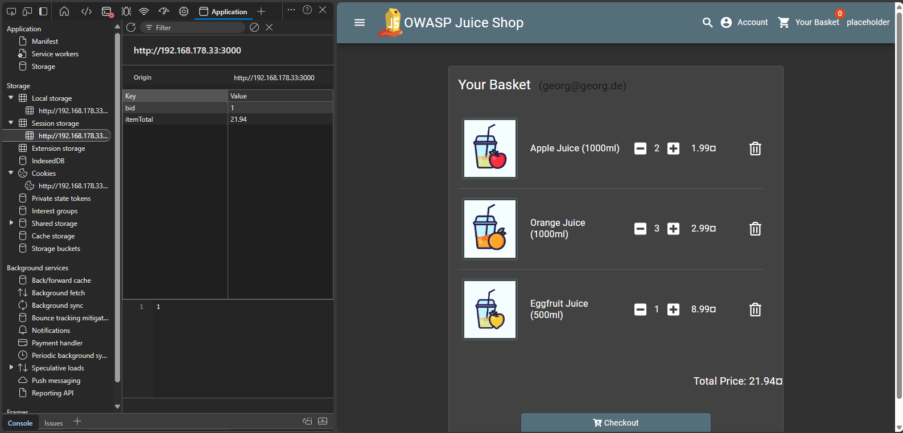
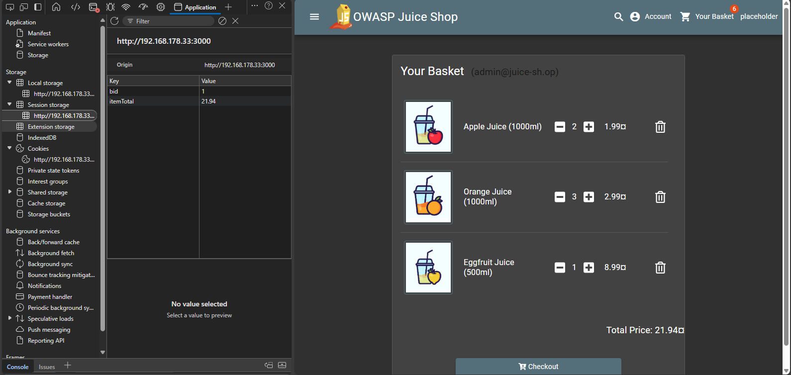

# View Basket

**Broken Access Control**

> *View another user's shopping basket.*

---

## Difficulty

⭐⭐☆☆☆☆ 2-Sterne-Challenge (easy)

---

## Beschreibung

This challenge demonstrates **horizontal privilege escalation**, where a user can access data that belongs to another user with the same privilege level. Specifically, it allows an attacker to view another user's shopping basket by manipulating client-side data.

If an attacker is able to link their session to a different `basketId`, they can see and manipulate items in someone else's basket — possibly even interfering with their checkout process. This represents a failure to securely associate user sessions with their own data on the server side.

---

## Hinweis
This horizontal privilege escalation challenge demands you to access the shopping basket of another user. Being able to do so would give an attacker the opportunity to spy on the victims shopping behaviour. He could also play a prank on the victim by manipulating the items or their quantity, hoping this will go unnoticed during checkout. This could lead to some arguments between the victim and the vendor.

- Try out all existing functionality involving the shopping basket while having an eye on the HTTP traffic.
- There might be a client-side association of user to basket that you can try to manipulate.
- In case you manage to update the database via SQL Injection so that a user is linked to another shopping basket, the application will not notice this challenge as solved.

---

## Approach

1. **Logged in** as a regular user and added a product to the basket.
2. Opened the browser DevTools (`F12`) and navigated to the **Application -> Session Storage**.
3. Observed the following keys:
    - `bid`: Current Basket ID
    - `itemTotal`: Total basket value
4. **Manually changed the `bid` value** to another number (e.g., `3`, `1`, `2`).
5. **Refreshed the page**.
6. The application displayed items from another user's basket.
7. The challenge automatically marked as **solved**.

---

## Evidence (Screenshots)

### My Original Basket

### Another User's Basket

### Admin Basket (for comparison)

:::
You successfully solved a challenge: View Basket (View another user's shopping basket.)
:::