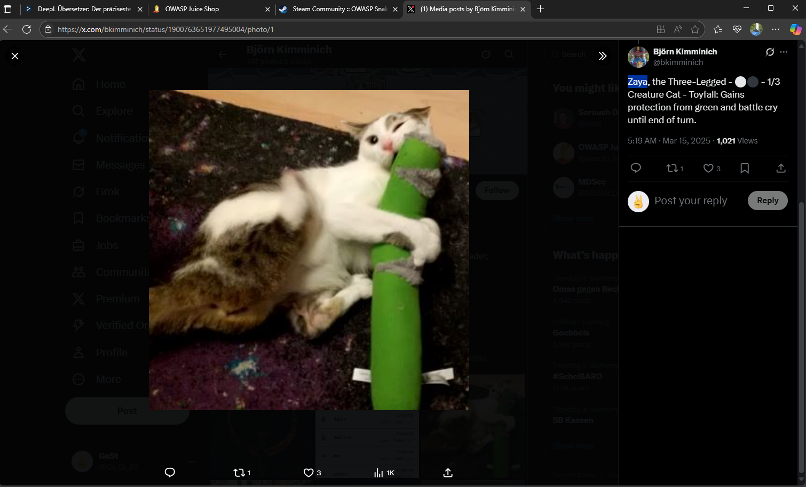

# Bjoern's Favorite Pet

**Broken Authentication**

> *Reset the password of Bjoern's OWASP account via the [Forgot Password](http://127.0.0.1:3000/#/forgot-password) mechanism with the original answer to his security question.*

---

## Schwierigkeit

⭐⭐⭐☆☆☆ 3-Sterne-Challenge (easy)

---

## Description

This challenge demonstrates a common authentication weakness, where users are allowed to reset passwords by answering personal security questions. While this mechanism is not a technical vulnerability in itself, it becomes one when the answer to the security question is **publicly accessible**, predictable, or guessable.

---

## Hint

This challenge is not about any technical vulnerability. Instead it is about finding out the answer to user Bjoern’s chosen security question and use it to reset the password of his OWASP account.

> Many website registrations use security questions for both password retrieval/reset and sign-in verification. Some also ask the same security questions when users call on the phone. Security questions are one method to verify the user and stop unauthorized access. But there are problems with security questions. Websites may use poor security questions that may have negative results:
>
> The user can’t accurately remember the answer or the answer changed, The question doesn’t work for the user, The question is not safe and could be discovered or guessed by others. It is essential that we use good questions. Good security questions meet five criteria. The answer to a good security question is:
>
> - Safe: cannot be guessed or researched
> - Stable: does not change over time
> - Memorable: can remember
> - Simple: is precise, easy, consistent
> - Many: has many possible answers
>
> It is difficult to find questions that meet all five criteria which means that some questions are good, some fair, and most are poor. In reality, there are few if any GOOD security questions. People share so much personal information on social media, blogs, and websites, that it is hard to find questions that meet the criteria above. In addition, many questions are not applicable to some people; for example, what is your oldest child’s nickname — but you don’t have a child.

- Hints to the answer to Bjoern’s question can be found by looking him up on the Internet.

- More precisely, Bjoern might have accidentally (😜) doxxed himself by mentioning his security answer on at least one occasion where a camera was running.

- Brute forcing the answer might be very well possible with a sufficiently extensive list of common pet names.

> Doxing (from dox, abbreviation of documents) or doxxing is the Internet-based practice of researching and broadcasting private or identifiable information (especially personally identifiable information) about an individual or organization.
>
> The methods employed to acquire this information include searching publicly available databases and social media websites (like Facebook), hacking, and social engineering. It is closely related to Internet vigilantism and hacktivism.
>
> Doxing may be carried out for various reasons, including to aid law enforcement, business analysis, risk analytics, extortion, coercion, inflicting harm, harassment, online shaming, and vigilante justice.

---

## Approach

1. Find the **right** email address.
   Email: `bjoern@juice-sh.op` | Question: `Your Zip/postal code when you were a teenager`
   

2. There is a review on a product card (Snakes & Ladders)
   Email: `bjoern@owasp.org`  | Question: `Name of your favorite pet?`
   
   

3. Focus on **bjoern@owasp.org** with the pet-related question.

4. Use **OSINT (Open Source Intelligence)** to research the user:
    - Search for `bjoern@owasp.org`
    - This leads to the real identity of **Björn Kimminich**, the creator of Juice Shop
    - He has a public profile on [Twitter/X](https://x.com/bkimminich/media)

5. Take a look at **Media** from Björn's X account. There are several cat pictures/videos posted, and the name **Zaya** sometimes appeared in the comments.

6. Go back to `Juice Shop` [Forgot Password](http://127.0.0.1:3000/#/forgot-password)
    - Enter `bjoern@owasp.org`
    - Answer: `Zaya`
    - Set a new password

7. Upon clicking "Change", the challenge is automatically marked as solved.

----

## Evidence (Screenshot)

:::
You successfully solved a challenge: Bjoern's Favorite Pet (Reset the password of Bjoern's OWASP account via the Forgot Password mechanism with the original answer to his security question.)
:::