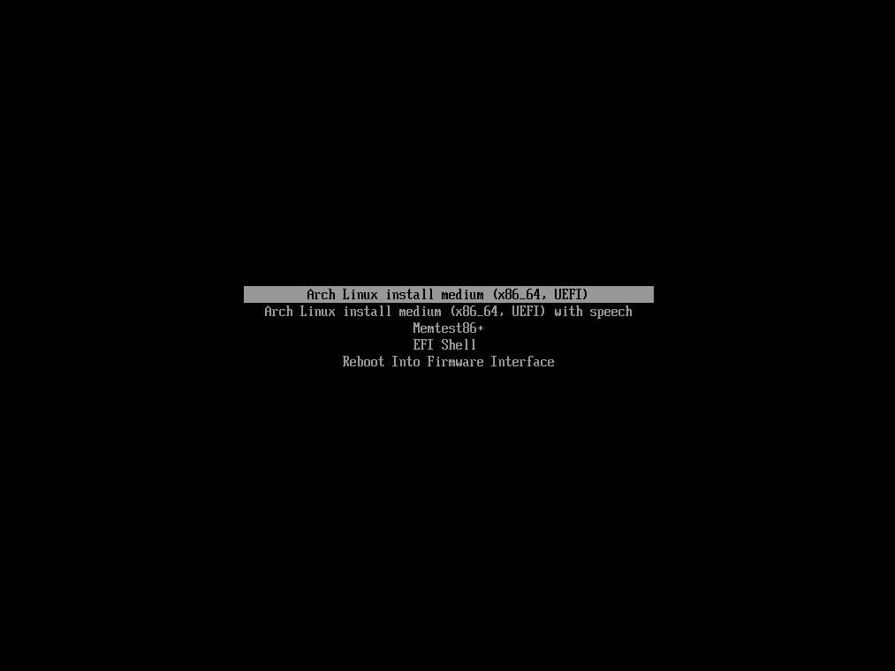
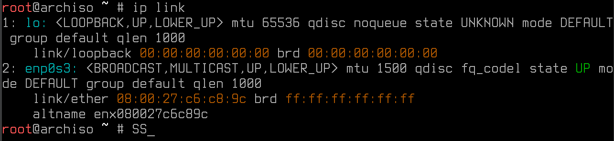
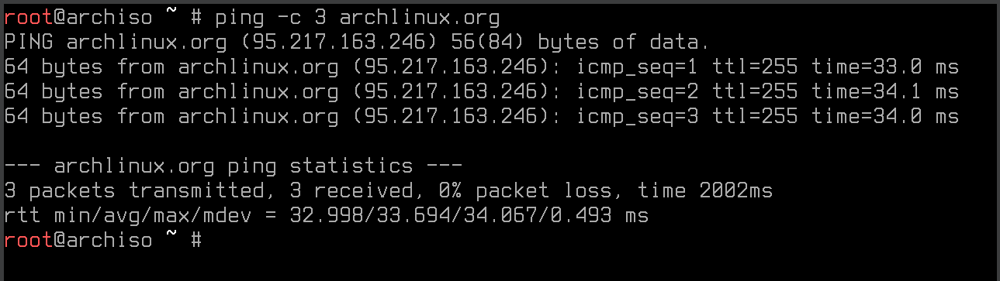
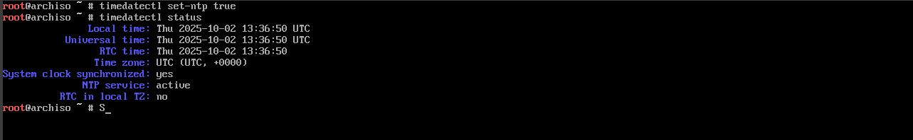
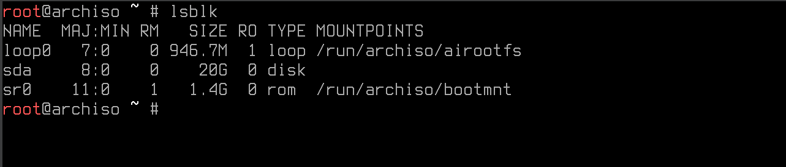

# Arch Linux install Guide

Install Arch Linux step by step on a VM, in this case with Virtual Box.

## Prerequesits

- Download the `archlinux-*.iso` file from [https://archlinux.org/download/](https://archlinux.org/download/)
- Download and install `Virtual Box` or create a usb-bootstick.

### Start Screen



- **Arch Linux install medium (x86_64, UEFI)** 
Du bootest ins Arch-Live-System (von dem ISO), um die Installation zu beginnen.

- **Arch Linux install meduim (x86_64, UEFI) with speech** 
Genau das gleiche wie oben, aber mit Sprach-Ausgabe (Text-to-Speech). Das ist für Menschen gedacht, die sehbehindert sind.

- **Memtest86+**
Ein Programm zum Testen des Arbeitsspeichers (RAM)

- **EFI Shell** - Reboot Into Firmware Interface 
Damit kann man Firmware-Kommandos ausführen.

- **Reboot Into Firmware Interface**
Zurück ins UEFI/BIOS-Menü

Wähle "Arch Linux install medium (x86_64, UEFI)" aus und bestätige es mit `Enter`.

---

### Live System

Jetzt befinden wir uns im Live-System von Arch Linux, alles läuft im RAM (Arbeitsspeicher) und von hier aus installieren wir es auf die Festplatte.

---

#### 1. Keyboard layout 

Für die Installation festlegen.

Am anfrang ist das Keyboard layout auf US eingesetllt und somit manche Tastenbelegungen anders als gewohnt wie z.B. `z` & `y`.

Alle Tastaturlayouts auflisten.
```bash
localectl list-keymaps
```

Das Tastatur layout auf DEUTSCH umstellen.
```bash
loadkeys de-latin1
```

---

#### 2. Internet prüfen

Die Installation wird übers Internet gemacht. Also schauen wir zuerst, ob wir eine Verbindung haben.

> Hinweis: Am besten über Ethernet (LAN) verbinden.

```bash
ip link
```



```bash
ping -c 3 archlinux.org
# oder z.B.
ping google.com
```



- Wenn wir eine **Antwort** bekommen mit (Zeit in ms), haben wir eine aktive Internet Verbindung.
- Wenn nicht, muss zu erst eine Internet Verbingung eingerichtet werden.

---

#### 3. Systemzeit synchronisieren

Arch braucht eine richtige Uhrzeit.

> `ntp` - Network Time Protocol

```bash
timedatectl set-ntp true # Erlaubt die Anfrage im Internet wie spät es ist.
timedatectl status
```



---

#### 4. Console fonts
**Console fonts** are located in `/usr/share/kbd/consolefonts/` and can be set. 

```bash
setfont ter-132b
```

---

#### 5. Partitioning (Festplatten speicher)

Liste all verfügbaren Festplatten auf.

```bash
lsblk
```



- `loop0`:  Das virtuelle Loop-Device. Arch lädt Teile des ISO-Images in den Speicher (RAM)
- `sda`: Das ist deine virtuelle Festplatte in der VM. Hier wird später Arch Linux installiert.
- `sr0`: Das ist dein virtuelles CD/DVD-Laufwerk. Hier liegt gerade das Arch-ISO, von dem du gebootet hast.

> Hinweis: Um sicher zugehen das ihr nicht dir falsche festplatte überschreibt. steckt sie vor der Installation aus

```bash
fdisk -l # Detailiertere auflistung
```

Am besten 3 patetionen erstellen.
 - SWAP um daten vom Arbeitsspeicher auf die Festplatte auszulagern
 - EFI
 - Dateisystem


Erste Patetion erstellen.

Unter dem Menü `gpt` auswählen `[New]` und die Partitions größe angeben: z.B. 4GB.
Anschließen einstell wofür die Partition sein soll. `[Type]` = `Linux swap`.

```bash
cfdisk /dev/sda/
```

| Select label type |
|:------------------|
| **gpt**           |
| dos               |
| sgi               |
| sun               |

Zeite Patetion soll eine `EFI` werden.

`>> Free space` wieder unter `[New]` eine neue Patetion erstellen mit der größe z.B. 1 GB und `[Type]` = `EFI System`.


Dritte Patetion 

`>> Free space` mit der vollen Größe erstellen und als Type `Linux filesystem` wählen.


Mit `[Write]` wird alles erstellt und mit 'yes' bestätigt.
> **WICHTIG** alle alten Daten sind anschließend verloren.

```text
Are you sure you want to write the partition table to disk? yes
```

Menü wieder mit `[Quit]` verlassen.

Zum Kontrollieren der Einstellungen nochmal die fdisk auflisten.
```bash
fdisk -l
```

Auf die 3te Patetion das entsprechende `filesystem` erstellen
```bash
mkfs.ext4 /dev/sda3 # Die patetion aus wählen mit dem Type Linus filesystem 
```

UEFI Zum booten erstellen
```bash
mkfs.fat -F32 /dev/sda2 # Die patetion aus wählen mit dem Type EFI 
```

SWAP Wenn der Arbeitsspeicher voll ist
```bash
mkswap /dev/sda1 # Die patetion aus wählen mit dem Type EFI 
```

Mounten

```bash
mount /dev/sda3 /mnt
```

```bash
mkdir /mnt/efi # Ordner erstellen
mount /dev/sda2 /mnt/efi 
```

SWAP einschalten und sagen wo es zu finden ist.
```bash
swapon /dev/sda1
```

Grundsystem erstellen
```bash
pacstrap -i /mnt base linux linux-firmware vim
```

- `-i` install 
- `/mnt` wohin
- `base` 
- `linux` 
- `linux-firmware`
- `vim` vi editor

There are 3 providers available for initramfs:
1) mkinitcpio
2) booster
3) dracut

Option 1 und mit `Y` bestätigen um die Grundinstallation abzuschließen.

---

#### 6. System einrichten

UUID SWAP und co verwendbar machen
```bash
genfstab -U /mnt >> /mnt/etc/fstab
```

Ins system verbinden `[root@archiso /]`
```bash
arch-chroot /mnt
```

Zeitzone richtig setzen
```bash
ln -sf /usr/share/zoneinfo/Europe/Berlin /etc/localtime
```

Hardwäre Uhr anpassen
```bash
hwclock --systohc
```

Locales erstellen
```bash
locale-gen
```
Locales einstellen
```bash
echo LANG=de_DE.UTF8 > /etc/locale.conf
```

Kontrollieren ob der eintrag erstellt worden ist
```bash
vim /etc/locale.conf
```

Tastatur layout auf dem system festlegen
```bash
echo KEYMAP=de_latin1 > /etc/vconsole.conf
```

Hosename festlegen
```bash
echo GEST_ARCH > /etc/hostname
```

Datei öffnen und bearbeiten.
```bash
vim /etc/hosts
```

```text
# Static table lookup for hostnames.
# See hosts(5) for details.
127.0.0.1   localhost
::1         localhost
# Local server für unseren Rechner
127.0.1.1   gest-arch.localdomain GEST_ARCH_PC
```

Netzwerk installieren
```bash
pacman -S networkmanager
```

```bash
systemctl enable NetworkManager # Erstellt die symlinks
```

Passwort des ROOT benutzers ändern
```bash
passwd
```

Bootmanager installieren
```bash
pacman -S grub efibootmgr
```

Auflisten der Festplatten Patetionen, um sicher zu stellen wo wir `/efi` finden um es dort hinein zu installieren
```bash
lsblk
# NAME          TYPE    MOUNTPOINTS
# sda       8:0         disk
#  |-sda1   8:1 part    [swap]
#  |-sda2   8:2 part    /efi
#  `-sda3   8:3 part    /
```

GRUB Installieren
```bash
grub-install --target=x86_64-efi --bootloader=GRUB --efi-directory=/efi --removable
# Installation finished. No error reported. <- Wenn alles geklappt hat
```

GRUB Konfig erstellen
```bash
grub-mkconfig -o /boot/grub/grub.cfg
```

Um wieder in der Arch ISO zurück zu kommen
```bash
exit
```

#### 7.

Wir sehen wieder am anfrang `root@archiso ~ #` und werfen die ISO aus.
```bash
umount -R /mnt
```
System Neustarten
```bash
reboot
```


---

#### 8.

```bash

```

