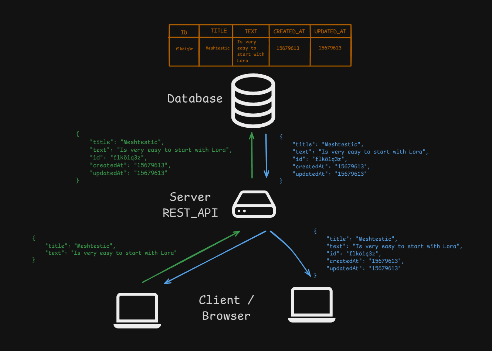

# Type Naming Conventions

***Übersicht:*** Meine Vorlage zur benennung der interface/type.

---

| Suffix     | Bedeutung                                     |
|:-----------|:----------------------------------------------|
| `Dto`      | Data Transfer Object - Daten für's API-In/Out |
| `Payload`  | Oft für reine Eingabedaten genutzt            |
| `Response` | Rückgabeobjekt der API                        |
| `Request`  | STruktur der eingehenden Anfrage              |
| `Entity`   | Datenmodel aus der Datenbank                  |
| `Model`    | Generischer Befriff, z.B. UI-Logik            |

| Kontext               | Typename                     |
|:----------------------|:-----------------------------|
| Eingabe-Formular      | `XyzFormData`                |
| Payload an API        | `XyzPayload`, `XyzCreateDto` |
| Serverantwort (API)   | `XyzResponseDto`             |
| DB-Modell/ORM-Entity  | `XyzEntity`                  |
| UI-Model (nur Client) | `XyzViewModel`               |


### Vereinfachtes Beispiel Muster

**Post:**

````ts
type PostDto = {
    title: string;
    text: string;
}
````

````ts
type PostEntity = PostDto & {
    id: string;
    createdAt: string;
    updatedAt: string;
}
````


**Registration & Anmeldung**

````ts
type UserRegistrationDto = {
    email: string;
    username: string;
    password: string;
}
````

````ts
type UserLoginDto = {
    email: string;
    password: string;
}
````

````ts
type UserEntity = UserRegistrationDto & {
    id: string;
}
````