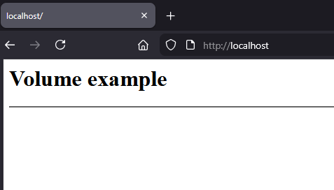
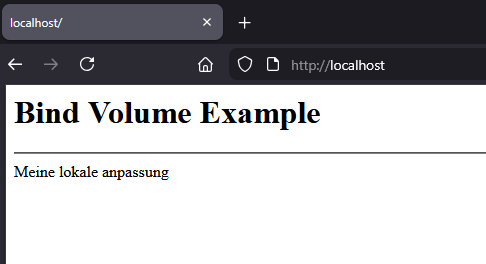

# Volume

Container sind „ephemeral“: Wenn du einen Container löschst, sind seine Daten weg – **außer** sie liegen außerhalb des Container-Filesystems.

---

## Vorbereitung (Demo)

Ordnerstruktur:

```text
example/
├── docker-compose.yml
└── page/                   # Mounted Folder
    └── index.html          # Custem Page
```

Beispiel: `page/index.html`
```html
<h1>Volume example</h1>
<hr />
```



---

## Named Volumes (von Docker verwaltet)

_Named Volume_ = Docker verwaltet Speicherort & Lifecycle des Volumes.
Perfekt für Persistenz (DB, Grafana, Jenkins, etc.) und Production.

Docker single container
```bash
docker run \
  -d \
  --name nginx-app \
  -p 80:80 \
  -v page_data:/usr/share/nginx/html:ro \
  nginx:latest
```

Docker Compose setup
```yaml
services:
  nginx:
    image: nginx:latest
    container_name: nginx-app
    ports:
      - "80:80"
    volumes:
      - page_data:/usr/share/nginx/html:ro

volumes:
  page_data:
```

---

## Bind Mounts (Host ↔ Container)

_Bind Mount_ Development, weil Änderungen sofort im Container sichtbar sind.

Volume wird von `Docker` selbst verwaltet

Docker (Single Container)
```bash
docker run \
  -d \
  --name nginx-app \
  -p 80:80 \
  -v ${PWD}/page:/usr/share/nginx/html:ro \
  nginx:latest
```

Docker Compose
```yaml
services:
  nginx:
    image: nginx:latest
    container_name: nginx-app
    ports:
      - "80:80"
    volumes:
      - ${PWD}/page:/usr/share/nginx/html:ro
```

Jetzt in der `page/index.html` den inhalt ändern.

```html
<h1>Bind Volume Example</h1>
<hr />
<article>Meine lokale anpassung</article>
```

Änderung speichern und die Seite im Browser neu laden `F5` zeigt die direkte verbindung in den Container.



---

## Bonus: Read-only mounts (Sicherheit)

Wenn du nur Dateien ausliefern willst (z.B. HTML), nutze `:ro`:
```bash
-v ./page:/usr/share/nginx/html:ro
```
Das verhindert, dass der Container deine Host-Dateien überschreibt.

---

## Volume Management

Volumes anzeigen
```bash
docker volume ls
```

Details eines Volumes
```bash
docker volume inspect page_data
```

Volume löschen
```bash
docker volume rm page_data
```

Nicht genutzte Volumes aufräumen
```bash
docker volume prune
```

---