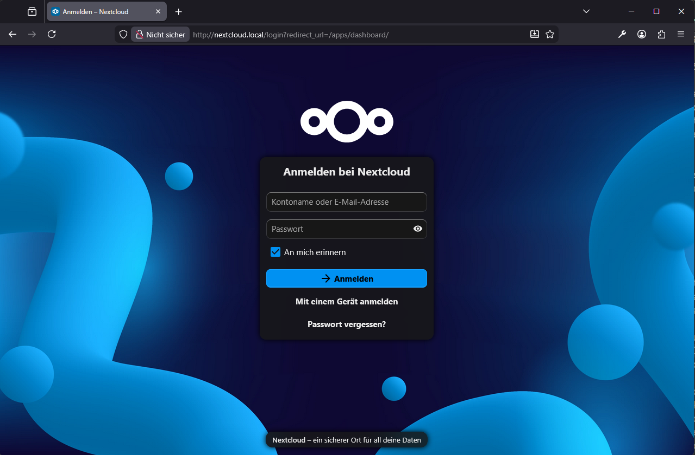

# Helm-Chart

Helm ist ein Paketmanager für Kubernetes. Der das installieren und verwalten von Kubernetes-Apps leichter gemacht.

---

## Installation von Helm

```bash
curl https://raw.githubusercontent.com/helm/helm/master/scripts/get-helm-3 | bash
```

```bash
sudo apt-get update
sudo apt-get install helm
```

Version Ausgeben lassen um zu sehen ob alles funktioniert hat
```bash
helm version
version.BuildInfo{Version:"v4.0.1", GitCommit:"12500dd401faa7629f30ba5d5bff36287f3e94d3", GitTreeState:"clean", GoVersion:"go1.25.4", KubeClientVersion:"v1.34"}
```

Wenn dein kubectl schon auf deinen k3s-Cluster zeigt (z. B. via ~/.kube/config), dann ist Helm sofort einsatzbereit.

```bash
kubectl get nodes
NAME      STATUS   ROLES                  AGE   VERSION
fujitsu   Ready    control-plane,master   40d   v1.33.5+k3s1
raspi     Ready    <none>                 40d   v1.33.5+k3s1
```

```bash
helm list
NAME  NAMESPACE  REVISION  UPDATED  STATUS  CHART  APP VERSION
```


## Nextcloud auf mein k3s

Ein Helm-Chart besteht aus einer Sammlung von YAML-Templates, die zusammen eine komplette Anwendung beschreiben, z. B.:
- Deployments
- Services
- ConfigMaps
- Persistent Volumes
- Ingress
- Secrets
- Abhängigkeiten (z. B. Datenbanken)

Statt dass du 20 YAML-Dateien manuell anlegen musst, installierst du einfach ein Chart:

```bash
helm install app-name chartname
```

### Anpassung des Helm-Charts

Per `values.yaml` kannst du alles überschreiben:

```bash
helm install meinecloud nextcloud/nextcloud -f /pfad/zur/values.yaml
```


Lokaler DNS Eintrag für die Weiterleitung auf deine NextCloud Instanz. 

Windows: `sudo notepad C:\Windows\System32\drivers\etc\hosts`
Linux|macOS: `sudo vim /etc/hosts`

```text
# Copyright (c) 1993-2009 Microsoft Corp.
...
# localhost name resolution is handled within DNS itself.
#	127.0.0.1       localhost
#	::1             localhost
<cluster-ip>    <domain-name>
192.168.178.52	nextcloud.local
```




===

## Schritt 1: Zertifikat als Secret im Cluster erstellen
```bash
kubectl create secret tls nextcloud-tls \
  --cert=nextcloud.crt \
  --key=nextcloud.key \
  -n default
```

## Schritt 2: In der values.yaml deinen TLS-Eintrag ergänzen

```text
ingress:
  enabled: true
  hostname: nextcloud.local
  tls: true
  
  extraTls:
    - hosts:
        - nextcloud.local
      secretName: nextcloud-tls
```

## Schritt 3: Helm-Release aktualisieren

```bash
helm upgrade nextcloud nextcloud/nextcloud -f pfad/zur/values.yaml

# meine value datei 
# /home/gest/k3s/helm/nextcloud-values.yaml
```
