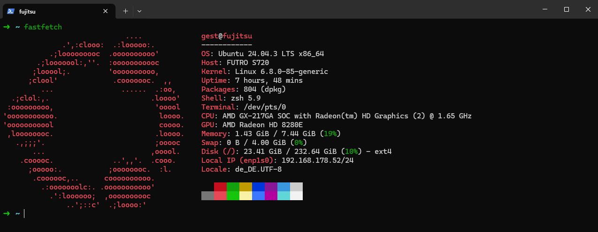

# K3s Home Cluster Setup

I have two machines in my home network: a **Fujitsu** and a **RaspberryPi4**. The `fujitsu` is to be the master/control plane and the `raspi` an additional worker node.

---

## Hardware:

- `fujitsu` | OS Ubuntu 24.04.3 LTS x86_64
- `raspi` | OS Debian 13 Trixie aarch64

Control-Plane & WorkerNode


WorkerNode


---

## Links

- [K3s/Quickstart](https://docs.k3s.io/quick-start)
- Einrichten der Verbindung per ssh-key

---

## Quickstart

### 1. Fujitsu 

Login with ssh-key & passphrase
```bash
ssh fujitsu
```

Install K3s

```
curl -sfL https://get.k3s.io | sh -
```

Output server/node token:

```
sudo cat /var/lib/rancher/k3s/server/node-token
```


Save the **node-token**, to add later the RaspberryPi4 as a WorkerNode. 

### 2. Raspberry Pi 4 

Login with ssh-key & passphrase
```bash
ssh raspi
```

Open the file:
```bash
sudo vi /boot/firmware/cmdline.txt
```

Open the file: 
```bash
sudo vi /boot/firmware/cmdline.txt
```

Add the following line:
```text
console=serial0,115200 console=tty1 root=PARTUUID=58b06195-02 rootfstype=ext4 elevator=deadline fsck.repair=yes rootwait cgroup_memory=1 cgroup_enable=memory
```

Install K3s and add it as a WorkerNode
```bash
curl -sfL https://get.k3s.io | K3S_URL=http://192.168.178.52:6443 K3S_TOKEN=K10910fa71db0cb054b574bf8a40f52828b4c3286cdc0695d24efbdd25ac113cc72::server:62f43601f5b0d2daf42dd86752e62bd3 sh -
```

### 3. Check the Cluster

On the MasterNode/Control-Plane:
```bash
sudo kubectl get nodes
```

```text
NAME      STATUS   ROLES                  AGE   VERSION
fujitsu   Ready    control-plane,master   1d   v1.33.5+k3s1
raspi     Ready    <none>                 1d   v1.33.5+k3s1
```


---

## Folder structure

```text
~/k3s
├── dashboard
│   ├── admin-user-secret.yaml
│   └── admin-user.yaml
├── demo-page
│   └── demo-page.yaml
└── httpd
    ├── httpd-deployment.yaml
    └── httpd-service.yaml
```