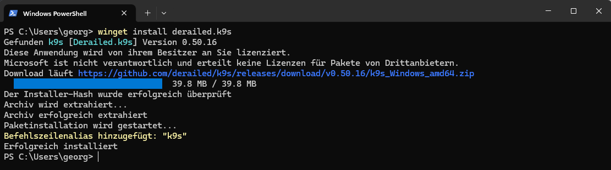
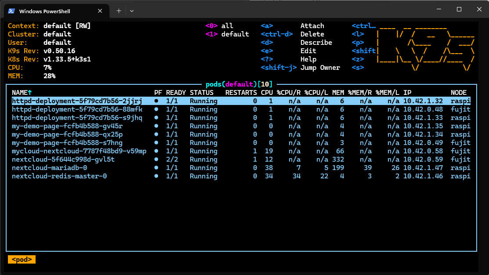

# k9s

k9s ist ein Terminal-Tool, mit dem du Kubernetes-Cluster viel schneller und einfacher verwalten kannst als nur mit kubectl.

---

Link zu [https://k9scli.io/](https://k9scli.io/)

---

Installieren von k9s

```powershell
winget install derailed.k9s
```




Starten k9s

```powershell
k9s
```



---

## Keystrokes:

- `l`   ->  open Logfile
- `s`   ->  open shell
- `ESC` ->  go back

**Port Forward**
1. `SHIFT+F` -> Port Forword -> das man mit localhost:5050 direkt auf den pot zugreift
2. `ENTER`   -> In den aktuellen pod wechseln
3. `F`       -> Port Forword's auflisten
4. `STRG+D`  -> Port Forword löschen
5. `ESC`     -> Wieder zurück gehen


---

