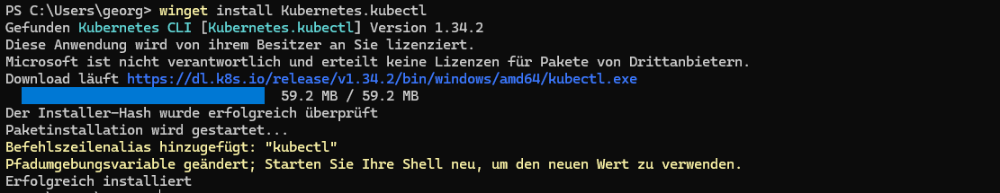
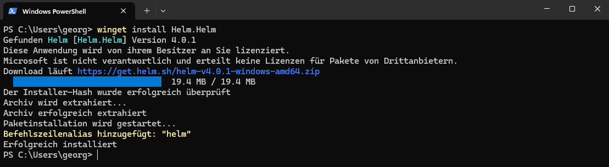
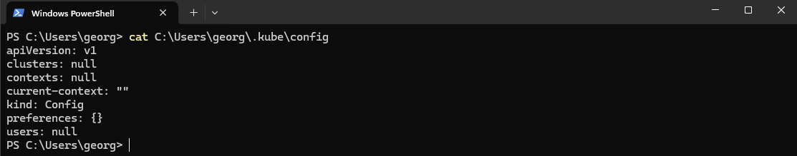
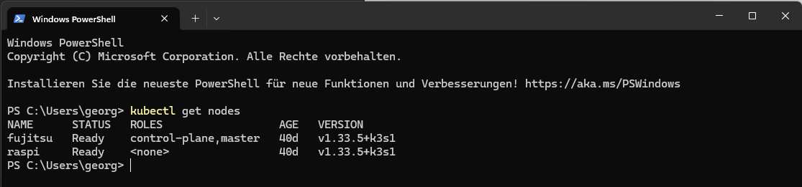

# Kubeconfig

Einrichten der API um extern auf den Cluster zugreifen zu können.

---

## Einrichtung kubeconfig 

Ordner erstellen wenn er noch nicht vorhanden ist
```bash
mkdir -p ~/.kube
```

Config Datei vom Cluster auf seine lokales gerät kopieren
```bash
scp ~/.kube/config user@host-ip:/home/user/.kube/config
```
Wenn das nicht möglich ist. Liegt die datei noch unter `/etc/rancher/k3s/k3s.yaml` und man benötigt root rechte.

Verbereitung der config datei.
```bash
sudo cp /etc/rancher/k3s/k3s.yaml ~/.kube/config
```

Besitzer und Zugiffsrechte von der Datei anpassen
```bash
sudo chown $USER:$USER ~/.kube/config
sudo chmod 600 ~/.kube/config
```

Beispiel: 
```
ls -la
-rw------- 1 gest gest 2953 Nov 25 21:20 config
```


## Windows einrichten

1. Installieren von kubectl

```powershell
winget install Kubernetes.kubectl
```


2. Installieren von helm

```powershell
winget install Helm.Helm
```


3. Lokale config ausgeben
```powershell
cat C:\Users\georg\.kube\config
```


4. Config vom Cluster holen und lokal ersetzen
```powershell
scp fujitsu:/home/gest/.kube/config C:\Users\georg\.kube\config
```

5. Anpassen der Server-IP im Editor im die entsprechende Control-Plane zu finden.

```powershell
notepad C:\Users\georg\.kube\config
```

```text
apiVersion: v1
clusters:
- cluster:
    certificate-authority-data: 
        LS0tLS1CRUdJTiBDRV
        ...
        lGSUNBVEUtLS0tLQo=
    server: https://127.0.0.1:6443  <-- hier die [Cluster-IP] vom [Control-Plan] angeben 192.168.178.52
  name: default
contexts:
- context:
    cluster: default
    user: default
  name: default
current-context: default
kind: Config
preferences: {}
users:
- name: default
  user:
    client-certificate-data: 
        LS0tLS1CRUdJTiBDRVJU
        ...
        eEIKLS0tLS1FTkQgQ0VSo=
    client-key-data: 
        LS0tLS1CRUdJTiBFQyBQUkl
        ...
        kFURSBLRVktLS0tLQo=
```

6. PowerShell einmal komplett schließen und neu öffnen.

```powershell
kubectl get nodes
NAME      STATUS   ROLES                  AGE   VERSION
fujitsu   Ready    control-plane,master   40d   v1.33.5+k3s1
raspi     Ready    <none>                 40d   v1.33.5+k3s1
```

