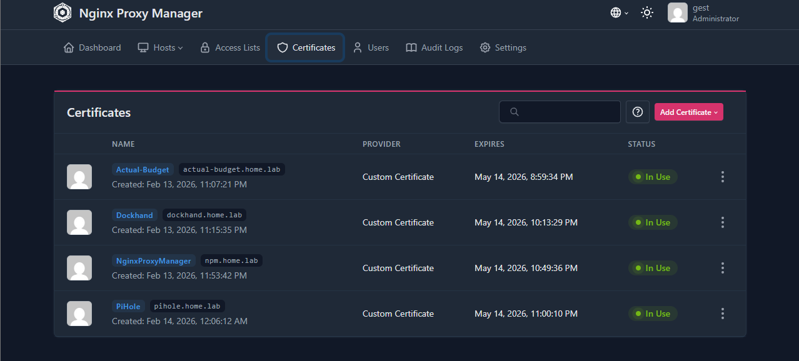
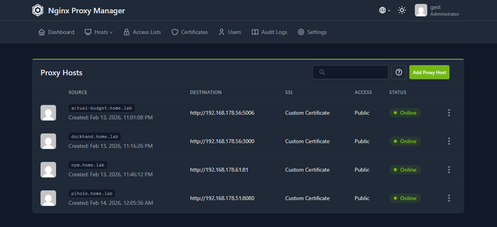
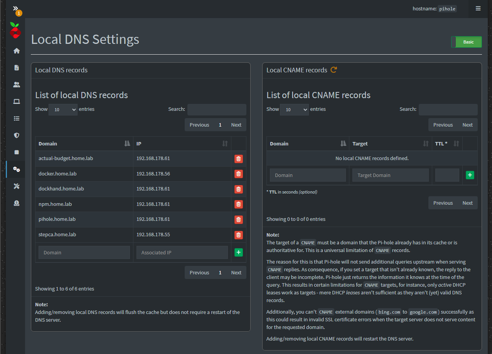
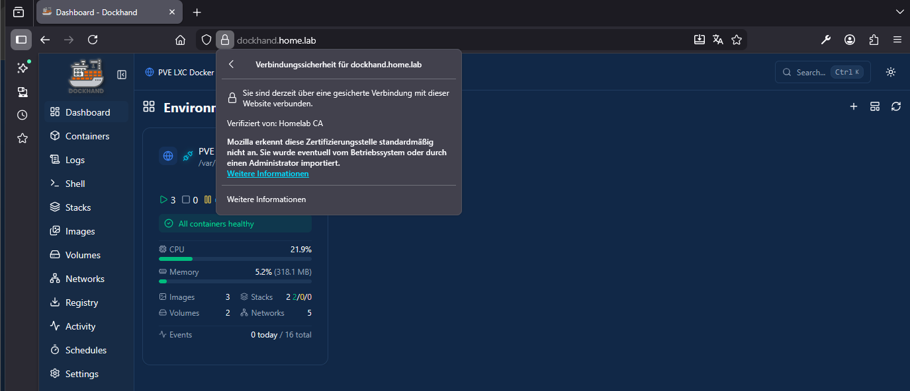

# Reverse Proxy

---

## Nginx Proxy Manager

Add Custem Certificat 

- Name  
- Certificate Key
- Certificate
- Intermediate Certifiace

Add Proxy Host

- Domain Names
- Scheme | Host IP | Port
- SSL -> Name of Custom Certifacte

---

## DNS (Pi-hole)

Add a local DNS record _Domain | IPv4_

__Hinweis:__
Der lokale DNS server muss im Router angegeben werden, das zuerst im Heimnetz gesucht wird und anschließend im Internet. Sonst werden die Seiten nicht gefunden.

__Hinweis:__
Das `root-ca.crt` muss auf den Geräten im Heimnetz einmal installiert werden z.B _Handy_, _PC_, _Laptop_, _Tablet_ damit Sie auch die einzellnen Zertifikate erkennen und als vertrauenswürdig einstufen können.

---

