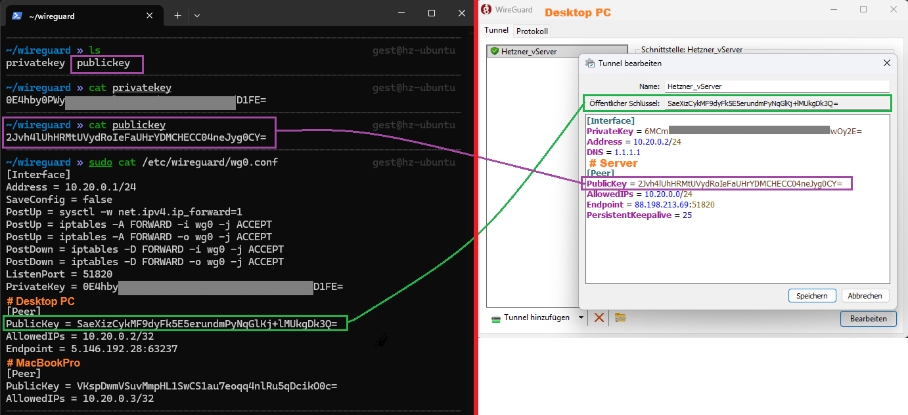

# Wireguard

VPN verbindung zwischen __Windows 11 PC__ und einem __Hetzner vServer__

---

## Architektur

```text
Client PC
10.20.0.2
     │
   Internet
     │
Host vServer
10.20.0.1
```

---


## 1. Wireguard auf dem vServer installieren

```bash
sudo apt update
sudo apt install wireguard -y
```

---

## 2. Server Schlüssel erzeugen

```bash
umask 077
wg genkey > privatekey
```

```bash
wg pubkey < privatekey > publickey
```

Keys ausgeben zur kontrolle
```bash
cat privatekey
cat publickey
```

---

## 3. Server Konfiguration erstellen

```bash
sudo nano /etc/wireguard/wg0.conf
```

```text
[Interface]
Address = 10.20.0.1/24
SaveConfig = true
PostUp = sysctl -w net.ipv4.ip_forward=1
PostUp = iptables -A FORWARD -i wg0 -j ACCEPT
PostUp = iptables -A FORWARD -o wg0 -j ACCEPT
PostDown = iptables -D FORWARD -i wg0 -j ACCEPT
PostDown = iptables -D FORWARD -o wg0 -j ACCEPT
ListenPort = 51820
PrivateKey = SERVER_PRIVATE_KEY #

[Peer]
PublicKey = CLIENT_PUBLIC_KEY #
AllowedIPs = 10.20.0.2/32
```

---

## 4. Firewall öffnen

Bei Hetzner Cloud: ->	Security Group:	->	UDP 51820 erlauben

```bash
sudo ufw allow 51820/udp
```

---

## 5. Client einrichten (Windows 11)

Downloaden und installieren von [WireGuard](https://www.wireguard.com/install/)
Neue Konfiguration erstellen: -> "Add Tunnel" -> "Generate Keypair"

```text
[Interface]
PrivateKey = CLIENT_PRIVATE_KEY
Address = 10.20.0.2/24
DNS = 1.1.1.1

[Peer]
PublicKey = SERVER_PUBLIC_KEY
Endpoint = DEINE_HETZNER_IP:51820
AllowedIPs = 10.20.0.0/24
PersistentKeepalive = 25
```

---

## 6. Client im Server eintragen (Desktop PC)

```bash
sudo nano /etc/wireguard/wg0.conf
```

```text
[Peer]
PublicKey = CLIENT_PUBLIC_KEY
AllowedIPs = 10.20.0.2/32
```



```bash
sudo systemctl restart wg-quick@wg0
```

---

## 7. verbindung Testen

Windows → Tunnel aktivieren

```bash
ping 10.20.0.1
```

Wenn Antwort kommt → VPN steht.


### Hinweis zur Konfigurtion

__Wichtig:__ Die PublicKeys müssen jeweils “gegenseitig” stimmen:

- Server [Peer] PublicKey = Windows Public Key
- Windows [Peer] PublicKey = Server Public Key


### Zugriff auf Docker Container verbindung Testen

__Wichtig:__
Bind nur an die WireGuard-IP (nicht 0.0.0.0!)
- `10.20.0.1:11434:11434`

Test container erstellen
```yaml
# ========================================#
# COMPOSE FÜR DIE LOKALE ENTWICKLUNG      #
# Ollama                                  #
# ========================================#

services:
  ollama:
    image: ollama/ollama:latest
    container_name: ollama_local
    ports:
      # WICHTIG: Bind nur an die WireGuard-IP (nicht 0.0.0.0!)
      - "10.20.0.1:11434:11434"
    volumes:
      - ollama:/root/.ollama

volumes:
  ollama:
```

In _Insomnia_/_Postman_ endpunkt abfragen: *http://10.20.0.1:11434/api/version*
```json
{
	"version": "0.16.1"
}
```

---

## 8. Client im Server eintragen (MacBookPro)

```bash

```

---
